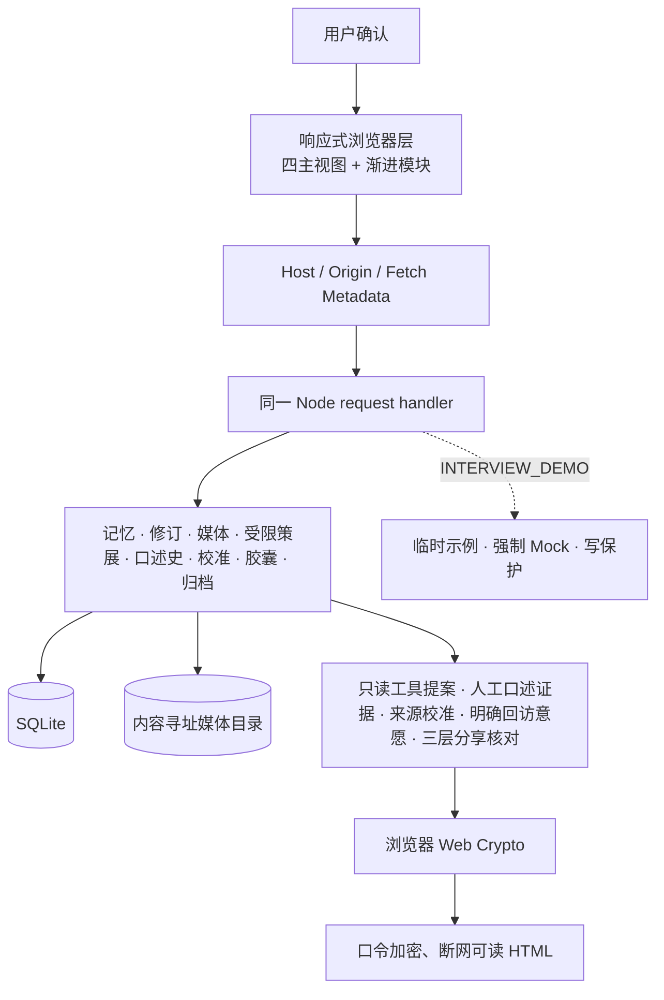

# 时屿（TIME ISLE）V10.0.0

> 本地优先的 AI 私人记忆策展工具

把散落的日记、聊天片段、照片与声音整理成一座可检索、可回顾的私人记忆岛屿；再把用户确认过的展览封存到未来，或生成口令加密、断网可读的单文件。

- Live Demo（V7.1.0）: https://ai-memory-museum-demo.vercel.app
- GitHub（已发布基线仍为 V7.1.0）: https://github.com/JieE-212/AI_memory_museum
- Demo 状态: https://ai-memory-museum-demo.vercel.app/api/demo/status
- 面试展示: [60 秒路线、90 秒讲解稿与架构图](./项目文档/面试展示手册.md)

> 本地版本状态（2026-07-18）：V10.0.0（schema 14）已完成受限本地策展助手、严格审计归档、健康投影与 Demo 零写边界；`npm.cmd run build`、`npm.cmd run check` 全绿，真实 HTTP smoke 247 条；策展 core 125、归档 94、界面 51、数据库健康 42、馆藏体检 83、Demo 安全 19、前端 109、JSON 导入 160、归档验真 42、媒体备份 300/恢复 185 条专项断言均已通过。基于浏览器 DOM 与真实交互的 1265×720、390×844、320×700 三档验收也已通过，并非仅凭截图判断。当前尚未推送、尚未部署，也不提前把本地提交写成已完成事实。
>
> 线上发布状态：公开 Demo 与 GitHub 已发布基线仍为 V7.1.0（schema 9）；该版本已于 2026-07-17 完成完整检查、迁移副本核对、本地验收、双远端推送与 Vercel 部署后验收。实际版本以线上 `/api/version` 与 `/api/health` 为准。

当前线上 V7.1 公开 Demo 只使用示例数据和临时 SQLite。它禁止私人图片或声音上传、媒体修改、展览与胶囊持久化、归档恢复、导入、删除与清空；访客新增的文本可能在同一临时实例中被其他访客看到，因此也请勿提交私人信息。Demo 在代码层强制使用本地 Mock，即使环境误配 `AI_API_KEY` 也不会调用外部模型；共享文本、整理运行、时光拼图与补问分别受 SQLite 事务内的固定硬上限保护。

本地 V10 的公开 Demo 配置沿用 4 件示例展品、1 场可分享的已确认展览，以及由两段校园记录组成的 1 个已确认事件和 1 项“保留多种记录”时间校准；符合条件时还可只读展示口述史问题与既有来源，但不会伪造可播放回答。受限策展助手由 `/api/curator-agent/sample` 合成只读工作区，不创建运行或接触持久化；所有策展助手非只读请求在解析请求体前返回 403。Demo 也不请求麦克风、不打开音频文件选择，不开放口述史、展览、回访意愿、校准、胶囊或媒体持久化。以上变化尚未进入线上 V7.1。

## 60 秒看懂

1. 在公开 Demo 的展品库搜索“阿棠”，查看两条毕业记忆及其命中字段、确认实体与短词回退依据。
2. 打开《操场尽头的告别》，沿这段记忆漫游到《后来写下的毕业傍晚》；进入时光拼图，对照双侧原文锚点和一天的日期差异。
3. 在本地 V10 的时光拼图展开“来源校准台”和“一问一答口述史”：先核对书面日期来源；仍无法解释冲突时，再由用户录音或选择音频、手工划定片段、填写文字稿并明确时间含义。两条链路都不会改写两段原文和展品日期。
4. 在“讲解与回顾”打开受限策展助手：选择 2–6 件虚构展品，查看四项只读工具回执和未保存提案，再逐项决定是否保存草稿、确认候选关系和发布；助手本身没有写工具，也不调用外部大模型。
5. 从已确认展览进入“胶囊与分享”，逐层核对公开外壳、口令内叙事与固定排除项，再生成浏览器端口令加密文件。

公开 Demo 负责稳定展示检索、引用、回访和记忆考古；完整图片、声音、胶囊、离线加密文件与 `.time-isle` 恢复使用虚构数据在本地演示。完整操作和讲解词见 [面试展示手册](./项目文档/面试展示手册.md)。

## 项目解决什么问题

普通笔记适合“写下来”，却不擅长在几年后回答这些问题：

- 哪些记忆和某个人、地点、情绪或画面有关？
- 一段原始叙述可以怎样被整理，而又不覆盖原文？
- 同一往事被多次写下时，哪些线索稳定、哪些只是后来补充？
- 同一往事出现多个日期时，怎样保留来源和用户判断，而不是由系统裁决唯一“真相”？
- 当书面日期仍无法解释分歧时，怎样留下可回放、可核对的口述证据，而不自动转写或替用户推断？
- 照片里的时间、局部画面和文字怎样成为可核对的线索，而不是自动结论？
- AI 的分类和回答依据了哪些内容？
- 私人文本、图片与声音如何在本地保存、完整迁移，同时提供安全的公开演示？
- 怎样把一段已经核对过的记忆留给未来，或安全地交给一个不登录时屿的人离线阅读？

时屿把这些问题收敛成一条清晰流程：

```text
记录原文、照片与声音 → 浏览器生成安全展示图 → AI 生成可编辑草稿 → 用户确认保存
→ 检索与引用回答 → 主题策展与记忆回访 → 对照原文与多模态证据 → 口述补证与来源校准
→ 受限本地助手生成带来源提案 → 用户逐项确认草稿/关系/发布 → 封存时间胶囊或生成口令加密的离线单文件
```

<details>
<summary>展开查看 V10 架构</summary>



</details>

页面始终只有“展品库、记录记忆、讲解与回顾、数据与项目”四项顶层导航。主题展览、受限策展助手、回访、线索检索、人物档案、语音、口述史、胶囊、记忆年轮、不确定时间线和馆藏体检均放在已有任务流内，通过默认折叠层、对话层或独立阅读层渐进呈现；移动端继续优先保证单列阅读与固定四项底栏。

## V4.0.0：影像记忆

### 本地图片归档

- 在现有“记录记忆”流程内添加 JPEG、PNG 或 WebP；每段记忆最多 6 张，单张原图默认上限 20 MB、4000 万像素。
- 浏览器通过 Canvas 生成最长边 1600 px 的静态 WebP 展示图和最长边 480 px 的缩略图，服务端再核对真实魔数、容器、尺寸、像素量与声明 MIME，不信任文件扩展名。
- 默认“仅保留安全展示图”：上传暂存原图只用于校验和提取允许的线索，完成后删除，只保存展示图与缩略图。
- 可显式选择“保留原图”：本机同时保存原图、展示图和缩略图；原图接口使用 `private, no-store`。
- 照片可设置封面、排序、说明、独立无障碍文字、拍摄时间和“照片背面”；无障碍文字留空时才以照片说明后备，卡片与详情始终使用安全展示版本。

### 内容寻址、复用与回收

- 图片资产以 SHA-256 内容哈希识别；保留原图时锚定原图，仅保留安全展示图时锚定规范展示图。
- 精确重复内容只有在既有全部变体重新通过磁盘大小与 SHA-256 校验后才会复用，而不是盲目丢弃新的健康上传；校验、刷新关联宽限期和丢弃上传处于同一媒体独占操作内。图片和展品使用多对多关联，同一张图片可被不同记忆引用。
- 仍被展品引用的图片不能直接删除；解除最后一个引用会立即隔离回收，删除展品和启动清理只处理已超过 24 小时宽限期的无引用 ready 资产，避免并发删除刚上传但尚未保存展品的图片。清空馆藏采用“先隔离文件、再提交数据库、最后物理删除”，失败可回滚；完整 purge、归档读写、上传完成、stale-stage 清理、隔离协调与 GC 共享同一进程内 FIFO，维护任务也采用 single-flight。启动时立即、运行中每 5 分钟协调 `.trash`，并扫描回收没有数据库记录的正式 `assets` 目录。

### 克制的图片线索

- EXIF 仅作为待确认线索。目前严格读取 JPEG APP1/Exif 中的拍摄时间、时区偏移、方向和 GPS；没有时区的时间保持本地 floating 值，不会擅自追加 `Z` 或覆盖记忆日期。
- GPS 始终标记为敏感信息，不联网反查地点，也不会自动写入展品地点；“仅保留安全展示图”不会保留敏感 EXIF 观察值。
- 用户可在照片上圈选区域，保存规范化 `x / y / width / height`、简短说明和来源图片 SHA-256。几何完整性与用户对语义的确认分开记录，时光拼图可以回到这块图片区域。
- 浏览器从规范展示图生成确定性的 9×8 采样，服务端计算 dHash、宽高比、颜色和低方差门槛。结果只叫“可能相似 · 需人工核对”，绝不自动合并、删除或认定为同一事件。
- 照片文字摘录优先使用浏览器本机 `TextDetector`，只处理用户圈选区域，不上传第三方；该能力不可用或识别失败时明确切换为手动摘录。任何结果都只是可编辑草稿，必须由用户核对确认后才保存为区域证据，不会自动改写展品正文。
- “时光叠影”由用户在左右图片各标两个对应点，浏览器本地计算缩放、旋转和平移并提供透明度调节、撤销与重置。它是手动两点对齐，不是自动识别，也不输出事件结论。

### 可验证的完整迁移

- 完整 `.time-isle` 归档包含馆藏、照片与声音二进制、媒体关联、图片线索、时光拼图、主题展览、回访状态与明确意愿、人物档案、事件级口述史、时间校准、时间胶囊、记忆修订，以及 V10 受限策展助手的审计记录。早期文字整理的 `agent_runs / steps / events` 仍不进入归档；V10 策展状态位于 `curator-agent/state.json`，恢复后强制成为待复核、不可再次决定的历史记录。口述史结构位于 `oral-history/state.json`，声音字节仍只存一份。
- 脱敏 `.time-isle` 会物理排除照片、声音、口述片段/文字稿与修订快照，并隐藏原始正文、人物、地点、媒体备注、胶囊私密字段和修订哈希，不只是把前端入口藏起来。
- manifest 会枚举每个数据和图片条目，并记录路径、字节数、MIME 和 SHA-256。恢复时先在隔离暂存区检查 gzip/ustar 结构、路径穿越、链接、重复与大小写碰撞、展开上限、manifest、哈希、真实图片格式、尺寸和所有引用关系。
- 默认导出与恢复共用 500 件展品、2000 个条目、单项 25 MiB、总展开 500 MiB 等硬上限；自定义参数只能收紧，不能生成默认无法恢复的归档。六图上限与 EXIF/GPS 隐私语义同样由 API、数据库、归档和恢复共同执行；EXIF source 只接受拍摄时间、方向和 GPS 三种严格 value 结构，未知类型或额外键会整项拒绝。
- 归档通过全量验真前不会写入正式数据库或媒体目录；损坏归档整批拒绝、零写入。验真通过后，数据库使用单次事务，文件阶段失败会清理已移动目录；同哈希图片只有在隐私策略、全部变体描述和本地文件哈希都一致时才复用。
- 旧 JSON 导入导出继续作为兼容工具，但不携带图片/声音二进制；非空口述史只验真并返回 `requiresTimeIsle`，需要完整迁移多模态证据时应使用 `.time-isle`。

## V7.0.0：时间胶囊与浏览器端加密分享

V7 不增加第五项导航。“胶囊与分享”位于“讲解与回顾”的馆藏回顾区域，只允许从已经发布且无需复核的主题展览开始。

### 封存到未来

- 时间胶囊只快照用户已经确认的展览内容，并把外壳、内容快照和图片关联分开保存；后续修改来源展览不会静默改写已经封存的内容。
- 开启日前，列表和详情只读取标题、寄语、日期、时区等外壳字段。`GET /api/capsules/:id/content` 返回 `423`、错误码和同一份公开外壳，不读取或下发正文、图片、成员列表与内部引用。
- 日期是本地仪式门槛，不是无法绕过的密码学时间锁。到期后可以在本机打开胶囊；若要把内容交给别人，仍应另外生成口令加密文件。

### 单文件、口令加密、断网可读

- 已核验的原文引用随确认展览进入加密内容；安全展示图和已确认文字稿则必须由用户逐项勾选。素材读取完成后才出现口令输入区，此后加密与文件生成不再发起网络请求。
- 浏览器使用 Web Crypto：PBKDF2-SHA-256（310,000 次）派生 256 位密钥，再以 AES-256-GCM 加密；每个文件使用随机 16-byte salt、12-byte IV，并把公开外壳作为 AAD 完整性保护的一部分。
- 口令只存在于当前页面内存，不上传服务端、不持久化，也不写入下载文件。生成的 `.html` 是自包含阅读页，到期后输入正确口令即可在断网环境打开。
- 分享包在生成结构上物理排除原图、EXIF/GPS、草稿文字稿、Agent 整理日志、数据库内部 ID 和所有未勾选内容；图片只允许隐私处理后的 display WebP。首版可以携带已确认声音文字稿，但不携带原始音频二进制。
- 文件没有账号、云端撤回或口令找回能力。发送者应通过另一条安全渠道告知收件人口令，并像对待私人相册一样保管导出文件。

## V7.1：可安装但不缓存私人馆藏

- “数据与项目”中的安装入口默认隐藏，仅在浏览器提供安装能力时渐进显示；iPhone 与 iPad 则显示“添加到主屏幕”指引，页面仍保持四项主导航。
- Service Worker 只缓存离线隐私边界页、该页样式和公开品牌 SVG。断网时明确说明无法读取馆藏，不用空页面伪装数据仍可用。
- 首页、API、图片、声音、归档和任何用户内容均不进入离线缓存；安装应用不会改变公开 Demo 的写入保护，也不会扩大私人数据范围。

## V7.2：记忆年轮与馆藏体检

- 每次创建和真实编辑都会保存规范化快照，以 SHA-256 锚定内容并用父哈希连接成可校验年轮；恢复旧版不会覆盖历史，而是把所选快照追加为新的 `head`。
- 编辑和恢复必须携带 `If-Match`，兼容客户端也可提交 `expectedUpdatedAt`。过期版本返回 `412`，完全相同的保存保持 no-op，不更新时间、不新增修订。
- “数据与项目”新增只读馆藏体检，核对 SQLite、外键、schema、FTS、修订链、图片和声音完整性，并把策展待复核与存储损坏分开呈现；首版只诊断，不自动修复。
- `.time-isle` 可先做只读归档验真，只返回是否可恢复、格式、schema、模式、条目字节数和安全计数，不把内容写入正式馆藏。JSON 与归档都会拒绝高于当前应用的 future schema。
- 完整修订 section 设有 20 MiB UTF-8 JSON 预算，旧 JSON 导入请求上限为 64 MiB；脱敏修订只保留计数摘要，正文、结构化字段、编辑备注、哈希、精确时间和内部 ID 会被物理移除。
- 导出、恢复或验真若因崩溃留下暂存目录，启动与定时维护只清理超过一小时且符合专用命名契约的目录；符号链接父目录和无关文件保持拒绝或跳过。

## V7.3：三层分享隐私编辑台与明确回访意愿

### 分享前先形成一次性的隐私副本

- 安全素材读取完成后，浏览器先形成不会回写来源展览的临时分享副本；章节、展品、已确认引用、已确认声音文字稿和安全 display WebP 默认均不选中，必须逐项选择，未选内容不会进入加密载荷。
- 第一层核对无需口令即可看到的公开外壳：标题、说明和文件名使用通用默认值，固定为立即开启，不自动复制来源展览标题、胶囊标题或导出时间。
- 第二层核对口令内的受众、用途、叙事副本、章节、展品与证据；叙事可为本次分享单独修改，至少保留 1 个章节、1 件展品，以及 1 条已确认引用或文字稿，媒体只保留仍有归属的安全展示图。
- 第三层汇总公开外壳、解密后内容和固定排除边界。用户完成最终勾选后才进入口令步骤；任何再次编辑都会撤销确认并清空已有口令。加密载荷内保存精确计数的分享回执，并明确“下载后无法撤回；知道口令的人仍可以复制、转发或截图”。
- V2 离线载荷严格连续重编号章节、展品和媒体，物理排除内部 ID、URL、SHA、原图、EXIF/GPS、草稿与所有未选内容；既有 V1 加密文件仍可解密阅读。

### 回访只听从用户明确选择

- 每件展品可明确设置“自然回访、欢迎主动出现、指定日期以后、暂停主动出现”。欢迎只在原有回访硬条件内提高顺序；延期在所选本地日期与 IANA 时区到达前排除；暂停会持续排除，直到用户亲自恢复。
- 意愿设置不保存自由文本原因，也不据此推断心情、关系或重要程度；它只影响主动回访，不隐藏、删除或降低馆藏搜索能力。公开 Demo 可展示设置方式，但所有意愿写入继续返回 403。
- schema 11 将非自然回访意愿纳入完整 JSON 与 `.time-isle` 归档，并在恢复时按展品 ID 映射原子迁移；脱敏归档只保留意愿总数与固定说明，物理排除展品 ID、选择、日期和时区。

## V8.0.0：不确定时间线与来源校准台

### 保存判断，不改写记忆

- 时间校准既可关联单件展品，也可关联用户已经确认的事件组；当前界面把事件校准放在“时光拼图”内默认折叠呈现，不增加第五项导航。
- 用户可以明确选择“确认一个日期、确认一个时间范围、保留多种记录、仍不确定”。日期或范围必须与每个所选来源相交，“保留多种记录”必须至少包含一对互不相交的来源；系统不会用无关来源支撑任意日期。
- 校准候选来自当前展品日期、可校验修订、仍有效的原文日期锚点，以及关联照片中非敏感的 EXIF 拍摄日期。GPS 严格排除；缺少来源时允许继续保留不确定，而不是补造日期。

### 来源变化后进入待复核

- 每项来源使用内容稳定的来源键，整组候选再生成 SHA-256 摘要；保存时必须提交当前摘要，并通过 ETag / `If-Match` 防止旧页面覆盖较新的校准。
- 保存时还会留下仅含来源键、类型、精度与起止日的最小快照。修订、原文锚点或照片时间发生变化时，旧判断及其日期含义不会丢失，也不会继续伪装成已核对；系统会派生 `needsReview`，在时间线、回顾与时光拼图中提示重新核对。
- `GET /api/timeline` 只返回展示时间线所需的最小事件成员边界；确认事件可以由此重新打开时光拼图。公开 Demo 预置一项“保留多种记录”示例，但所有校准写入与删除固定返回 403。

### schema 12 可验证迁移

- 完整 JSON 与 `.time-isle` 将 `timeCalibrations` 作为 schema 12 必需 section，恢复时随展品和事件 ID 映射迁移；完整归档同时记录保存时与导出时当前来源摘要，恢复重建的当前摘要必须与导出摘要一致，合法的旧判断则继续以 `needsReview` 保留。
- 若旧 JSON 不携带媒体来源，恢复会保留校准并明确返回需要 `.time-isle` 才能完整核对来源，不会静默删除判断。脱敏归档只保留校准总数、“保留多种记录”数、“仍不确定”数和固定说明，物理排除日期、来源、备注、ID 与哈希。

## V9.0.0：事件级一问一答口述史

### 人工补证，不让机器代述

- 系统只在用户已确认属于同一往事、书面日期来源双侧都有依据且仍互相冲突时，确定性生成一个事件级问题；入口收在时光拼图内并默认折叠，不增加第五项导航。
- 用户可以录制一段 WebM，或选择本地 WebM / M4A；随后必须亲手划定声音开始与结束毫秒、填写文字稿，并明确选择 `day / range / uncertain`。V9 不自动转写、不识别说话人、不判断情绪，也不从声音推断日期。
- `confirmed + day/range` 才会成为事件级 `oral-history` 时间来源；`confirmed + uncertain` 只保存为可回看的口述证据，`draft` 不进入时间候选。任何回答都不会覆盖原始记忆、修订、EXIF 或既有日期。

### 追加历史、并发与撤回

- 回答使用 `draft / confirmed / superseded / withdrawn` 追加式状态。确认新回答会让旧回答进入 `superseded`，撤回则保留历史并停止作为当前来源；旧证据默认折叠，而不是物理删除。
- 写入同时校验 `ETag / If-Match`、当前 `questionSetSha256` 与稳定 `submissionId`：缺少前置条件或问题集合已变化时拒绝保存，网络重试则可幂等返回同一次提交。
- 新增、替换或撤回答案会让引用旧口述来源的时间校准进入 `needsReview`，但不会自动改写校准结果。被口述史引用的声音资产计入使用量，普通删除与 GC 不得把它误判为孤儿。

### schema 13 可验证迁移

- Schema 13 新增独立的 `oral_history_questions` 与 `oral_history_answers`。完整 `.time-isle` 增加 required section `oral-history/state.json`；声音字节仍只保存在 `voices/assets/...`，不会在口述史 section 复制。
- 恢复按“记忆/修订/媒体 → 记忆考古事件 → 声音 → 口述史 → 时间校准 → 其余模块”的依赖顺序执行，并重写事件、声音、问题与回答 ID；映射后仍要保持稳定来源身份与当前状态。
- JSON 不携带声音二进制，因此只要 `oralHistories` 非空就只做严格验真并返回 `requiresTimeIsle`，不恢复半套回答。脱敏口述史只保留问题数、回答数、已确认回答数与固定说明，物理排除声音片段、文字稿、日期、标识和哈希。
- `INTERVIEW_DEMO=true` 只读展示问题与已有来源；麦克风、音频文件选择和口述史 PUT / DELETE 全部关闭或返回 403，不产生声音字节和数据库写入。

## V10.0.0：受限本地策展助手

### 只读查阅，只生成提案

- 助手位于“讲解与回顾”的既有任务流内，不增加第五项导航。用户可明确选择 2–6 件展品或输入查询；执行器使用确定性的本地证据规则，不调用外部大模型。
- 唯一工具白名单是 `search_memory_summaries`、`read_memory_evidence`、`read_confirmed_relationships`、`read_exhibition_summaries`。它不能访问网络、文件、任意 SQL，也没有保存、发布、删除或分享工具。
- 固定预算限制为最多 6 步、4 次只读工具调用、2 秒、262,144 字节结果和 6 件来源展品。运行可以取消；进程重启时仍在运行的任务转为 `interrupted`，不会后台续跑。
- 输出只有绑定请求和来源摘要的 `proposal / preview`、四项只读回执与可重放评测。馆藏来源变化后，旧提案保留为只读并进入 `needsReview`，不能继续决定。

### 三项人工决定，不自动分享

- `save_exhibition`、`confirm_relationship`、`publish_exhibition` 必须在界面中逐项批准或拒绝；每次写入都要求 `confirm: true`、当前 `ETag / If-Match` 与稳定 `Idempotency-Key`。
- 保存只创建草稿，发布依赖已经保存的草稿；关系候选没有得到人工批准就不会落库。批准和拒绝都留下追加式决定回执，助手不能批量授权。
- 分享不在动作白名单中。已发布展览只交接现有三层隐私编辑台，章节、展品、引用、确认文字稿和 display WebP 仍默认不选并由用户逐项确认。
- 公开 Demo 的 `GET /api/curator-agent/sample` 只合成一份只读工作区，不读写运行表；所有策展助手 POST / DELETE 在读取请求体或接触持久化前返回 403。

### schema 14 审计与恢复边界

- Schema 14 新增 `curator_agent_runs / steps / proposals / decisions` 四表，以数据库约束固定状态、预算、JSON、外键、步骤顺序和幂等唯一性；步骤、提案和决定回执不可原地更新。
- `evaluation` 只使用保存的回执重放本地规则，核对预算、步骤顺序、结果哈希、来源集合与提案哈希；它不会重新调用工具或重复副作用。
- 完整 JSON 与 `.time-isle` 增加 `curator-agent/state.json`。恢复会重写运行、步骤、提案与决定 ID，并强制所有导入运行成为 `historical + needsReview + allowDecisions: false`，使用隔离幂等域，不能把历史批准重新执行。
- 脱敏归档只保留运行、完成/取消、提案、决定和批准/拒绝计数与固定说明，物理排除目标、展品 ID、工具参数/结果、提案正文、内部 ID、哈希和时间戳。
- 馆藏体检验证四表结构及完整备份合同，只公开七项策展安全计数；`interrupted / needsReview` 是人工注意项，结构损坏才是 blocker，诊断不包含目标、工具、提案或哈希。

## 其他核心功能

- 记忆整理：从原始文本生成标题、展厅、标签、人物、情绪和展品说明。
- 可追踪整理流程：将一次模型调用（无 Key 时为本地规则）组织为档案提取、策展标注和草稿生成三个阶段，保存 run、step 与 event 处理快照。
- SQLite 馆藏：记忆、标签、人物、情绪、Agent run、媒体资产、媒体关联与图片观察均在本地持久化。
- 混合检索：综合匹配标题、正文、人物、地点、标签和情绪，并返回命中原因、置信提示及对应展品的照片摘要。
- 引用式讲解：将 Top-K 检索展品作为回答上下文，并展示同批来源、命中字段与规则强度；当前不声称完成真实模型输出的逐句引用校验。
- 记忆航线：基于人物、地点、日期、标签、情绪和原文关键词发现少量关联，并解释为什么相连。
- 时光拼图：比较同一往事的多个候选版本，区分稳定锚点、描述差异、单侧补充和未知项；文字与图片证据都可回到来源。
- 不确定时间线：在已确认事件中核对日期来源并保存一个日期、一个范围、多种记录或仍不确定；来源变化后提示待复核，不裁决唯一真实时间。
- 一问一答口述史：针对仍未解决的事件日期冲突保存人工选段、人工文字稿和显式时间含义；只让已确认的 day/range 成为独立时间来源。
- 补一块拼图：一次只提出一个最值得补充的问题，允许回答、跳过或明确保留不确定。
- 馆藏回顾：按时间聚合展品，发现共同主题，并生成简短回顾摘要。
- 主题展览：从用户选择的展品生成带章节、引用和安全媒体的预览，确认后才保存为正式展览。
- 记忆回访：一次呈现一件“往年今日、很久没见或随机漫游”的记忆，并允许用户明确设置欢迎、延期、暂停或恢复自然回访；不用浏览状态或意愿推断用户心理。
- 语义线索检索与人物档案：在原搜索入口解释命中字段和召回原因；未接入 embedding 时不冒充向量检索。
- 语音记忆：保存本地录音、音频文件与人工确认文字稿；公开 Demo 禁止麦克风和音频写入。
- 时间胶囊与离线分享：从已确认展览封存安全快照，或通过三层隐私编辑台生成带加密分享回执的自包含 HTML。
- 面试 Demo：示例数据、临时数据库、破坏性操作保护、媒体写入保护、代码层强制 Mock 和固定资源上限。

## 技术栈

- 前端：Vanilla JavaScript、HTML、CSS、Canvas、MediaRecorder、Web Crypto；可选浏览器原生 `TextDetector`
- 后端：Node.js 原生 HTTP Server
- 数据库：Node.js 内置 `node:sqlite`
- 图片存储：本地文件系统、SHA-256 内容寻址、JPEG / PNG / WebP 严格校验
- 归档：无额外依赖的 gzip + POSIX ustar `.time-isle`
- 部署：Vercel Functions + 静态资源（仅公开、临时、禁媒体写入的 Demo）
- AI：OpenAI-compatible Chat Completions；无 Key 时使用本地规则回退

项目刻意不引入前端框架、ORM 和额外运行依赖，让数据流、隐私边界与恢复事务更容易阅读和讲解。

## 项目结构

```text
项目工程/
  api/index.js                    # Vercel API 入口
  database.js                     # SQLite、Agent 轨迹、考古证据、媒体与修订编排
  server.js                       # HTTP 路由、AI 回退、Demo 隔离与归档编排
  lib/
    migrations.js                 # schema 迁移账本与顺序门禁
    archaeology.js                # 可解释关联、时光拼图与单问题算法
    archaeology-backup.js         # 拼图、Claims 与补问的备份/恢复
    demo-safety.js                # Demo 临时路径、清理边界与误配置防护
    request-security.js            # Host、Origin 与 Fetch Metadata 请求边界
    revision-*.js                 # SHA-256 父链、并发条件、历史恢复与备份
    revisit-intent-database.js    # schema 11 明确回访意愿与归档合同
    time-calibration-service.js   # 日期范围、来源键与候选集合的纯规则
    time-calibration-database.js  # schema 12 校准、待复核派生与备份恢复
    time-calibration-api.js       # 时间线及 memory/event 校准读写边界
    oral-history-service.js       # 事件问题、人工选段与口述时间来源规则
    oral-history-database.js      # schema 13 追加状态、并发与备份恢复
    oral-history-api.js           # ETag、幂等提交、撤回与 Demo 只读
    oral-history-backup.js        # 口述史完整/脱敏归档精确合同
    curator-agent-service.js      # 固定预算、四项只读工具、提案与重放评测
    curator-agent-database.js     # schema 14 四表、运行状态、逐项决定与历史恢复
    curator-agent-api.js          # 运行/取消/评测/决定 API 与 Demo 合成示例
    curator-agent-backup.js       # 完整/脱敏审计合同、ID 重写与历史授权隔离
    collection-health*.js         # 只读数据库、图片、声音与待复核体检
    archive-inspection-api.js     # 不恢复数据的 .time-isle 全量验真
    archive-staging.js            # 崩溃遗留归档暂存的边界化清扫
    media-format.js               # 图片魔数、容器、尺寸与像素边界校验
    media-storage.js              # 暂存、内容寻址变体、隔离删除与清理
    media-database.js             # 资产、变体、关联与观察的数据访问层
    media-api.js                  # 上传、展示、关联、区域、指纹和 GC 接口
    media-evidence.js             # 规范化图片区域证据与来源哈希锚点
    exif-hints.js                 # 严格 EXIF 待确认线索解析
    media-similarity.js           # 确定性 dHash 与近似候选分类
    time-isle-archive.js          # 严格 gzip/ustar 创建和解包
    media-backup.js               # .time-isle manifest、导出与全量验真
    media-restore.js              # ID 映射、事务恢复与文件补偿
    capsule-service.js            # 胶囊安全快照、到期判定与隐私约束
    capsule-database.js           # 胶囊外壳、内容与媒体关联的分表持久化
    capsule-api.js                # 胶囊外壳、创建、开启和 Demo 保护接口
    offline-exhibit-api.js        # 候选素材和加密前材料读取接口
    demo-seed.js                  # 四件公开示例与一场已确认展览的确定性播种
  public/
    index.html                    # 四个主视图与渐进披露入口
    styles.css                    # 全局响应式界面
    revisions.css                 # 记忆年轮对话层
    collection-health.css         # 馆藏体检与归档验真面板
    archaeology.css              # 记忆航线与拼图样式
    capsules.css                  # 胶囊书架、素材选择与口令步骤样式
    share-privacy.css             # 三层分享隐私编辑台样式
    revisit-intents.css           # 明确回访意愿与管理区样式
    time-calibrations.css         # 默认折叠的来源校准台与时间线账本
    oral-histories.css            # 默认折叠的一问一答、选段与来源卡
    curator-agent.css             # 受限助手对话层、提案、决定与技术回执
    media*.css                    # 图片、证据、叠影、OCR 与线索实验室样式
    assets/
      app.js                      # 前端状态、交互与核心 API 调用
      revisions.js                # 历史版本查看、比较与恢复
      collection-health.js        # 体检进度、结果和只读归档验真
      media.js                    # 图片选择、派生图、上传和详情图库
      media-intelligence.js       # EXIF 呈现与浏览器指纹采样
      media-evidence.js           # 图片区域圈选与证据列表
      media-compare.js            # 手动两点叠影
      media-ocr.js                # 本机 TextDetector / 手动文字摘录
      media-lab.js                # 近似候选与文字摘录入口
      portability.js              # .time-isle 导出与恢复
      capsules.js                 # 胶囊、素材选择、匿名载荷组装与离线文件交互
      capsule-crypto.js           # 浏览器端 PBKDF2 + AES-GCM 与自包含阅读页
      share-privacy.js            # 一次性分享副本、最小投影与分享回执
      revisit-intents.js          # 用户明确回访意愿交互与长期设置管理
      time-calibrations.js        # 来源卡、校准表单、待复核与时间线摘要
      voice-capture.js            # 单段录音/本地音频与可取消采集状态机
      oral-histories.js           # 问题、人工选段、文字稿与回答历史
      curator-agent.js            # 来源选择、只读执行、提案预览与逐项决定
  scripts/
    check-all.js                  # 统一编排语法、规则与 HTTP 回归
    api-smoke.js                  # 本地真实 HTTP 端到端断言
    demo-safety-check.js          # Demo 删除路径的 fail-closed 回归
    request-security-check.js      # DNS rebinding 与同源写入回归
    media-api-check.js            # 隔离恢复、墓碑清理与事务补偿回归
    archaeology-check.js          # 引用合法性与考古规则回归
    media-*-check.js              # 媒体格式、存储、证据、智能与恢复回归
    archive-check.js              # 严格归档攻击面回归
    capsule-*-check.js            # 胶囊服务、数据库、API 与前端回归
    offline-exhibit-check.js      # 真实安全快照、隐私投影、加密与离线阅读页回归
    revisit-intent*-check.js      # 明确回访意愿的服务端与浏览器回归
    time-calibration*-check.js    # 时间来源、API、归档和浏览器交互回归
    oral-history*-check.js        # 口述史领域、归档与浏览器交互回归
    curator-agent*-check.js       # 受限执行、审计归档和浏览器交互回归
    voice-capture-ui-check.js     # 录音/文件选择、取消与 Demo 零请求回归
  项目文档/
    产品说明.md
    技术设计.md
    V5-V10扩展路线.md
```

## 本地运行

要求 Node.js 24 或更高版本。

```powershell
npm.cmd start
```

打开 `http://127.0.0.1:3000`。默认数据位置：

```text
data/memory-museum.sqlite
data/media/
```

指定其他端口、数据库或媒体目录：

```powershell
$env:PORT = "3001"
$env:DB_PATH = "C:\path\to\memory-museum.sqlite"
$env:MEDIA_ROOT = "C:\path\to\memory-media"
npm.cmd start
```

本文在 Windows PowerShell 中使用 `npm.cmd`，可避开系统将 `npm` 解析为受执行策略限制的 `npm.ps1`；macOS、Linux 或 Vercel 构建命令直接使用 `npm` 即可。

## AI 配置

复制 `.env.example` 为 `.env`：

```text
AI_BASE_URL=https://api.openai.com/v1
AI_MODEL=gpt-4.1-mini
AI_API_KEY=your-key
AI_TIMEOUT_MS=20000
```

`AI_API_KEY` 留空时，记录整理和讲解员仍可工作，只是由本地规则生成结果。图片格式校验、EXIF、指纹、相似候选、区域证据、手动叠影和本机文字摘录都不依赖该 Key。

V10 受限策展助手始终使用确定性的本地证据规则和四项只读工具，即使配置了 `AI_API_KEY` 也不会调用外部模型。该 Key 只影响既有的文字整理/讲解路径，不能扩大策展助手的工具或审批权限。

`INTERVIEW_DEMO=true` 时始终强制使用 Mock，配置的 `AI_API_KEY` 会被忽略；真实模型只允许在非 Demo 的受控本地环境使用。公开 Demo 对共享文本馆藏、整理运行、时光拼图和补问分别设置事务硬上限；检查与写入在同一 SQLite 事务内，达到上限后返回 429，避免并发匿名请求突破边界。

## 常用接口

馆藏与策展：

- `GET /api/health`、`GET /api/version`：版本、模式、AI 状态和馆藏统计。
- `GET /api/demo/status`、`GET /api/privacy`：Demo 限制和数据位置说明。
- `GET /api/options`：展厅选项、文本限制与当前媒体策略。
- `GET /api/memories`、`GET /api/memories/:id`：读取带照片摘要或完整照片列表的馆藏。
- `POST /api/analyze`：生成展品草稿和三阶段处理轨迹。
- `POST /api/memories`、`PUT /api/memories/:id`、`DELETE /api/memories/:id`：保存、编辑和删除展品；编辑必须携带 `If-Match` 或 `expectedUpdatedAt`。
- `GET /api/revisions`、`GET /api/memories/:id/revisions`：读取最近修订或单件展品的记忆年轮；单版详情与追加式恢复使用 `/:revisionId` 及其 `/restore` 子路径。
- `GET /api/search?query=关键词&mode=hybrid`：带命中依据的混合检索。
- `POST /api/guide`：基于引用展品回答问题。
- `GET /api/insights`：时间线、主题和回顾摘要。
- `GET /api/curator-agent/sample`：公开 Demo 合成的只读策展工作区，不创建运行或写入数据库。
- `GET|POST /api/curator-agent/runs`、`GET|DELETE /api/curator-agent/runs/:id`：列出/创建、读取或显式删除本机运行；创建与删除使用稳定幂等键，删除还要求当前 `If-Match`。
- `POST /api/curator-agent/runs/:id/execute|cancel`：明确启动或取消一次固定预算的只读执行；运行不会后台续跑。
- `GET /api/curator-agent/runs/:id/evaluation`：只根据保存回执重放评测，不重新调用工具或执行写入。
- `POST /api/curator-agent/runs/:id/decisions`：逐项批准或拒绝保存草稿、确认候选关系、发布；要求 `confirm: true`、`If-Match` 和 `Idempotency-Key`，公开 Demo 统一返回 403。

图片与线索：

- `POST /api/media/uploads` → `PUT /api/media/uploads/:uploadId/display|thumb` → `POST /api/media/uploads/:uploadId/complete`：原图校验、派生图写入和内容寻址完成流程。
- `GET|HEAD /api/media/:assetId/thumb|display|original`：按图片保留策略读取已有变体。
- `GET|POST|PUT /api/memories/:memoryId/media`：列出、关联或整体更新展品图片；单项编辑与解除关联使用 `PUT|DELETE /api/memories/:memoryId/media/:assetId`。
- `GET|POST /api/memories/:memoryId/media/:assetId/annotations`：读取或创建图片区域证据；单项更新、删除使用其 `/:annotationId` 子路径上的 `PUT|DELETE`。
- `GET|POST /api/media/assets/:assetId/fingerprint`：读取或生成规范展示图指纹。
- `GET /api/media/assets/:assetId/similar?limit=8`：返回只供人工复核的可能相似候选。
- `GET /api/media/usage`：统计被馆藏引用的媒体与变体用量。

展览、胶囊与离线分享：

- `GET /api/exhibitions?status=published`：列出已经确认、可以作为胶囊或分享来源的主题展览。
- `GET|POST /api/capsules`、`GET|DELETE /api/capsules/:id`：读取公开外壳，或从已确认展览创建和删除本地胶囊；公开 Demo 不持久化胶囊。
- `GET /api/capsules/:id/content`：仅在本地开启日到达后返回安全快照；未到期固定返回 `423` 和公开外壳。
- `GET /api/offline-exhibits/candidates?exhibitionId=...`：只列出来源展览内可选的 display WebP 与已确认文字稿。
- `POST /api/offline-exhibits/material`：读取用户明确选择的安全材料，供浏览器随后离线加密；请求体不包含口令。

记忆考古与迁移：

- `GET /api/archaeology/routes?focus=展品ID`：生成焦点航线或今日航线。
- `GET /api/archaeology/puzzle?memoryId=A&relatedId=B`：返回原文锚点、图片区域证据和可手动叠影的两侧图片。
- `POST /api/archaeology/events`、`DELETE /api/archaeology/events/:id`：用户确认关联或解除版本组，原文继续保留。
- `POST /api/archaeology/questions`：保存补充回答、跳过或“保留不确定”。
- `GET /api/timeline?order=asc&limit=...`：读取不确定时间线及重新打开拼图所需的最小事件成员边界。
- `GET|PUT|DELETE /api/time-calibrations/memories/:id`、`/api/time-calibrations/events/:id`：读取候选来源或明确保存、移除校准；写入要求 `confirm: true`、当前来源摘要与 `If-Match`，公开 Demo 只读。
- `GET|PUT|DELETE /api/oral-histories/events/:id`：读取事件级问题、当前回答与折叠历史，或以 `If-Match`、`questionSetSha256` 和 `submissionId` 保存/撤回答案；公开 Demo 只读。
- `GET /api/archive/export`：下载完整 `.time-isle`；`?mode=redacted` 下载物理排除私人媒体与胶囊私密字段的脱敏归档。
- `POST /api/archive/inspect`：只读验真 `.time-isle` 并返回安全摘要，不恢复正式数据。
- `POST /api/archive/restore`：上传 `.time-isle`，全量验真后原子恢复；公开 Demo 返回 403。
- `POST /api/collection-health/scans`、`GET|DELETE /api/collection-health/scans/:id`：启动、读取或取消一次本地只读馆藏体检。
- `GET /api/memories/export`、`POST /api/memories/import`：不含图片二进制的旧 JSON 兼容工具；导入请求上限为 64 MiB。

## 检查

```powershell
npm.cmd run build   # 语法与模块回归，不启动 HTTP smoke
npm.cmd run smoke   # V10 当前 247 条本地真实 HTTP 端到端断言
npm.cmd run check   # 上述全部检查
```

`npm.cmd test` 等价于 `npm.cmd run check`。检查数据使用系统临时目录，并在结束时清理，不会写入正式馆藏。

V8 已完成基线的历史回归计数：

- 真实 HTTP smoke：211 条。
- 时间校准服务端、数据库、API 与归档合同：151 条；时间校准 UI：206 条。
- JSON 馆藏导入：123 条；媒体归档备份：237 条；媒体归档恢复：158 条。
- 归档只读验真：17 条；数据库健康：26 条；馆藏体检：66 条。
- 前端结构与可访问性：96 项；既有分享、回访、胶囊、声音、媒体和 PWA 回归继续纳入整库检查。

V9 在上述基线上新增 `oral-history-check.js`、`oral-history-ui-check.js`、`oral-history-backup-check.js` 与 `voice-capture-ui-check.js`，覆盖问题资格、录音/本地音频、人工选段、文字稿与时间含义、四种回答状态、ETag/If-Match、问题集合摘要、幂等提交、口述来源、声音引用保护、JSON `requiresTimeIsle`、schema 13 `.time-isle` 映射恢复和 Demo 零写请求。

V9 最终关键回归计数：真实 HTTP smoke 227；前端 104；口述史 94、口述归档 18、单段声音采集 UI 26、口述史 UI 37；时间校准后端 158、UI 206；JSON 馆藏导入 141；媒体归档备份 266、恢复 170；PWA 79。完整 `npm.cmd run check` 全绿；桌面、390px 与 320px 真实浏览器验收通过，窄屏无横向溢出、关键触控目标 44px、控制台零错误。

V10 新增 `curator-agent-check.js`、`curator-agent-backup-check.js` 与 `curator-agent-ui-check.js`，并把 schema 14 审计结构接入数据库健康、馆藏体检、JSON / `.time-isle`、只读归档验真、Demo 安全和真实 HTTP 流程。当前具名专项计数为：受限策展 core 125、严格归档 94、界面 51、数据库健康 42、馆藏体检 83、Demo 安全 19、前端 109、JSON 导入 160、归档验真 42、媒体备份 300/恢复 185，均已通过；完整 `npm.cmd run build`、`npm.cmd run check` 与 247 条 smoke 全绿。真实浏览器三档还验证了四导航/移动底栏、无横向溢出、移动全屏工作台、保存/关系/发布逐项决定、隐私编辑台默认零素材，以及最近记录的只读打开、离线重放和删除二次确认。

真实 HTTP smoke 继续覆盖静态页面与安全头、DNS rebinding Host 拒绝、同源写入、Mock 整理、展品 CRUD、修订父链与并发冲突、检索与讲解、图片和语音链路、主题展览、回访及明确意愿、语义线索、胶囊锁定、馆藏体检、只读归档验真与 future schema 拒绝；V9 还验证口述史创建/替换/撤回、`draft` 与 `uncertain` 不成为日期来源、day/range 成为事件级来源、校准进入 `needsReview`、声音免受误删、非空 JSON 要求 `.time-isle`、完整/脱敏 schema 13 恢复和公开 Demo 403。V10 追加验证策展 sample 零写、运行/取消/幂等、只读工具白名单、固定预算、逐项决定、来源变更、回执重放、schema 14 完整/脱敏历史恢复和 Demo 非只读 403。完整回归继续覆盖格式与存储事务、严格脱敏、20 MiB 修订预算、64 MiB JSON 导入、崩溃暂存清扫、三层分享隐私投影、浏览器端加密信封和自包含阅读页。

## 设计边界

- 本地 HTTP 服务只接受 `127.0.0.1`、`localhost` 和 `[::1]`（可带 1–65535 端口）；部署模式只接受平台注入域名和 `ALLOWED_HOSTS` 中的精确主机。`POST / PUT / PATCH / DELETE` 还必须带与 Host 精确同源的 `Origin`；浏览器提供 `Sec-Fetch-Site` 时只接受 `same-origin`。
- AI 建议先形成草稿；EXIF 只保存为 `suggested` 线索；OCR 摘录必须由用户核对确认；近似图片只返回候选且不触发合并或删除。四类结果不会混成“系统已确认”的事实。
- 原始记忆与展品说明分开保存，避免 AI 改写覆盖事实来源。
- 讲解员只接收检索结果作为上下文，并把同批来源交给用户核对；真实模型回答尚未做逐句引用一致性评测。
- 航线、近似照片和手动叠影永远只是核对辅助；系统不会自动宣称两段记录或两张照片属于同一事件。
- 缺失信息不等于矛盾，只有两侧都有可校验来源时才展示“描述不同”。
- 同一往事的多个版本分别保存，确认关联也不会覆盖任何原文。
- 时间校准只记录用户确认的展示判断和来源摘要，不会回写原文或展品日期；来源集合变化时旧判断保留但进入待复核，GPS 不会成为校准候选。
- 口述史只保存用户亲自选定的声音片段、手填文字稿和显式时间含义；不自动转写、识别说话人或判断情绪。只有已确认的 day/range 回答成为时间来源，撤回与替换始终保留追加历史。
- 受限策展助手只运行四项本地只读工具并生成未保存提案；没有外部大模型、任意工具或后台自治。保存草稿、确认候选关系和发布必须逐项确认，分享继续由三层隐私编辑台独立完成。
- 编辑原文时会重新校验已保存的字段证据；失效摘录不会继续标记为已核验。
- 记忆年轮用于发现本机历史被意外改写，并不等同于外部时间戳、公证账本或多用户审计；旧版恢复始终追加新 head，不倒退或删除已有链条。
- 馆藏体检与归档验真首版只给出可核对诊断，不自动修复、删除或恢复数据。
- 本地媒体能力使用文件系统，不是云对象存储。公开 Vercel Demo 明确禁止媒体写入和归档恢复，也不部署私人 SQLite 或真实 AI Key。
- 非空口述史依赖同一归档内的事件映射和声音字节，普通 JSON 只能验真并返回 `requiresTimeIsle`；完整迁移必须使用 `.time-isle`，不能恢复没有声音的半套回答。
- 时间胶囊的本地日期只控制产品仪式；真正的分享保密来自浏览器端加密。离线文件一旦交付，当前没有账号撤回、口令找回或远程失效能力。
- 系统不会自动发布展览、确认人物/事件关系或分享任何口述与媒体内容；这些动作继续由用户逐项确认。
- 当前适合个人本地使用和面试演示；多用户认证、跨设备同步、云端持久数据库与云媒体存储不在 V10.0.0 范围内。

更多说明见 [产品说明](./项目文档/产品说明.md)、[技术设计](./项目文档/技术设计.md) 和 [V5–V10 扩展路线](./项目文档/V5-V10扩展路线.md)。部署步骤见 [DEPLOYMENT.md](./DEPLOYMENT.md)。
