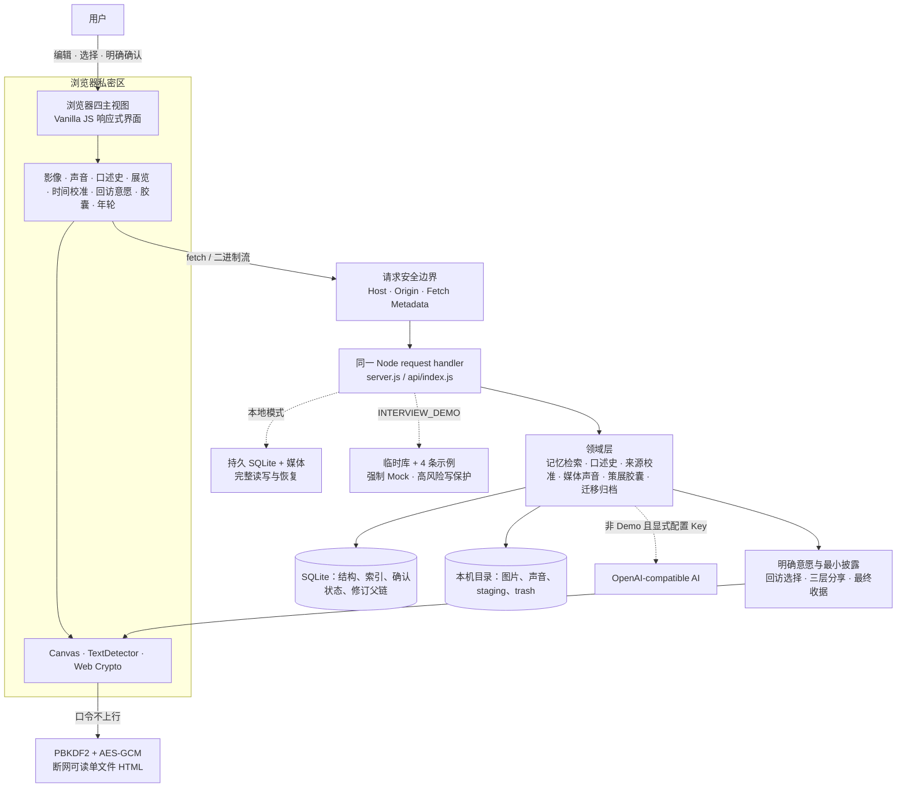

# 时屿 V9 本地基线面试展示手册

> 状态（2026-07-18）：本地 `V9.0.0 / schema 13` 已完成实现与最终验收，`npm.cmd run check` 全绿、HTTP smoke 227 条；桌面、390px 与 320px 真实浏览器视口通过，窄屏无横向溢出、关键触控目标 44px、控制台零错误。当前尚未推送或部署，也不提前声明本地提交已完成。公开线上 Demo 与 GitHub 已发布基线仍为 `V7.1.0 / schema 9`。

## 一句话定位

时屿不是“可以放图片的备忘录”，而是一套本地优先的私人记忆策展工具：AI 或规则只生成草稿，原文与多模态来源保持独立；面对互相矛盾的时间记录，系统先展示书面来源，再让用户用人工选段、手填文字稿和显式时间含义补充口述证据，而不是替用户转写、判断情绪或编造唯一真相。

## 60 秒展示路线

面试前预先打开两个标签：

- 线上公开 Demo：`https://ai-memory-museum-demo.vercel.app`
- 本地 V9：`http://127.0.0.1:3000/#reflect`，只使用虚构测试数据

| 时间 | 操作 | 讲什么 |
| --- | --- | --- |
| 0–8 秒 | 展示线上首页和四项导航 | 页面始终只有四个主任务；公开环境使用临时示例并禁止私人媒体写入。 |
| 8–18 秒 | 在展品库搜索“阿棠” | 两字短线索也能找到两条毕业记忆，并展示命中字段、确认实体和短词回退依据。 |
| 18–30 秒 | 点击《操场尽头的告别》的标题区域，再点“沿这段记忆漫游” | 展品说明与原始记忆分开保存；系统只给出可解释关联，不自动认定同一事件。 |
| 30–45 秒 | 打开《后来写下的毕业傍晚》对应的“查看拼图” | 人物、地点和“毕业”有双侧原文锚点；日期相差一天；缺证据的部分明确保留未知。 |
| 45–60 秒 | 切到本地时光拼图，展开校准台和“一问一答口述史” | 书面来源逐项可回看；口述史只在仍未解决时出现，声音片段、文字稿与时间含义都由用户确认，Demo 禁止写入。 |

前 45 秒的线上主线已在 V7.1.0 公开 Demo 实际走通。最后 15 秒必须切到本地，因为线上尚未部署 V8/V9；本地 Demo 沿用 4 件展品、1 场已确认展览和 1 项“保留多种记录”时间校准，符合条件时只读展示口述问题。公开模式不请求麦克风、不打开文件选择，并拒绝口述史、校准、展览、胶囊、声音或长期回访意愿写入。不要在公开页面上传私人内容，也不要把禁写保护描述成缺失功能。

如果现场网络不稳定，只演示本地标签；如果本地胶囊素材尚未准备好，就停在时光拼图并口述加密边界，不临时制造或上传真实私人素材。

## V9 60 秒专项路线

先用本地 `INTERVIEW_DEMO` 展示只读边界；若要真实录音和保存，必须切到隔离可写数据库并只使用虚构内容：

1. 在 `#reflect` 展开“不确定时间线”，打开两段日期相差一天、但已由用户确认属于同一往事的时光拼图。
2. 先展开“校准这段时间”，说明当前日期、修订、原文 claim 与非敏感 EXIF 是书面来源；GPS 不进入候选，系统也不提供真相分数。
3. 展开“一问一答口述史”：只有事件仍未解决、双侧都有依据且日期区间互斥时，规则才生成一个问题；它不调用模型自由发挥。
4. 在隔离可写模式录制一段 WebM 或选择本地 WebM/M4A，用两个 range 划定开始/结束，也可把当前播放位置设为边界；随后手填文字稿。
5. 明确选择 `day / range / uncertain` 并确认文字稿。指出只有 `confirmed + day/range` 成为事件级时间来源，uncertain 只保留口述证据，draft 不进入时间线。
6. 指出回答历史的 `confirmed / superseded / withdrawn`：重答或撤回不抹掉旧证据，只使引用旧来源的校准进入 `needsReview`；原文和两件展品日期都不变。
7. 说明并发边界：保存使用 `ETag / If-Match + questionSetSha256 + submissionId`；公开 Demo 不请求麦克风或文件选择，PUT/DELETE 固定返回 403。

如果没有准备虚构音频，只展示 Demo 的问题与禁写边界，不临时上传私人声音，也不要伪造可播放来源。V9 的自动门禁与三档真实浏览器验收已经完成。

## 三分钟深挖路线

1. 在“记录记忆”展开添加照片与添加声音，说明两种图片隐私策略、三段声音上限和人工确认文字稿；再区分普通展品声音与事件级口述回答。
2. 打开一件含图片的虚构展品，展示安全展示图、图片区域证据、来源 SHA-256 与“用户确认”是两层不同保证。
3. 展开“记忆年轮”，查看旧版并停在恢复确认框，说明有效修改、no-op、SHA-256 父链和 `If-Match` 并发边界。
4. 进入记忆航线与时光拼图，先展开来源校准台，再展开一问一答口述史；强调相似线索、手动叠影、日期差异和口述回答都不会触发自动合并、自动转写或事实裁决。
5. 在展品详情设置“欢迎、延期或暂停”之一，再恢复自然回访；说明没有保存原因，也没有从浏览行为推断重要程度。
6. 从已确认主题展览进入“胶囊与分享”，展示未到期开启返回外壳而不读取载荷。
7. 在三层编辑台逐章、逐件选择一张 display WebP 和一份 confirmed 文字稿，核对受众、用途、计数和不可撤回边界，再生成自包含 HTML。
8. 在“数据与项目”运行只读馆藏体检，并用测试 `.time-isle` 验真 schema 13 的 `timeline/calibrations.json` 与 `oral-history/state.json`；声音字节只在 `voices/assets/...`，公开 Demo 不接收归档。

## 90 秒讲解稿

时屿不是相册，也不只是一个能放图片的备忘录。我把它定义成一个本地优先的私人记忆策展工具。用户保存原文、照片和声音，AI 或本地规则只生成可编辑草稿，原文始终单独保留。照片区域还会同时记录规范坐标和内容 SHA-256，把“来源仍可校验”和“这条说明由用户确认”分成两层。

屏幕上的两条毕业记忆，人物和地点相同，但日期相差一天。系统会展示两边的原文锚点、稳定线索和描述差异，却不会自动认定它们是同一事件，更不会覆盖任何一段原文，最后决定权仍在用户。

V8 在用户已经确认“这是同一往事”之后增加来源校准台。它把当前日期、修订、原文日期锚点和照片 EXIF 分开呈现，用户可以确认单日、范围、保留多种记录或继续不确定。来源集合变化时，旧判断只进入待复核，不被删除；稳定哈希用于发现来源变化，不用于证明哪一段记忆为真。

V9 再回答“书面来源仍解释不了时怎么办”。系统只为符合条件的确认事件生成一个问题；用户录音或选择本地音频后，亲手划定片段、填写文字稿并明确回答代表单日、范围还是仍不确定。它不自动转写、识别说话人或判断情绪。只有人工确认的 day/range 成为事件级口述来源；uncertain 只留下可回看的证据，重答和撤回都保留追加历史，不覆盖原始记忆。

V7 又把“留给未来”和“安全交给别人”拆成两套边界。时间胶囊的日期只提供仪式门槛，未到期接口在读取私密载荷前就返回 423；真正的分享保密发生在浏览器端。V7.3 再加入三层隐私编辑台：公开外壳使用不含来源标题和导出时间的通用默认值；受众、用途、叙事副本与逐项证据都在密文内；最后用精确收据再次确认。只有用户勾选的安全材料才会进入 PBKDF2-SHA-256 与 AES-256-GCM 加密的断网 HTML。

V7.2 再补上“记忆如何变化”的证据：有效修改形成规范快照的 SHA-256 父链，无变化保存不制造版本；恢复旧版只新增一个 `restored` head，原历史完整保留，`If-Match` 则阻止过期页面覆盖新修改。这条链可以发现断裂，但不是区块链或不可篡改审计系统。

V7.3 还回答“以后怎样再见”：欢迎、指定日期以后或暂停都必须由用户明确确认。系统只做确定性筛选和排序，不保存原因、不猜心情，也不影响馆藏和搜索；恢复自然回访会删除这条长期偏好。schema 11 将它作为独立 required section 进入完整归档，脱敏时只留下总数。

数据默认保存在本地 SQLite 和媒体目录。馆藏体检只读核对数据库、图片、声音、口述史与待复核时间判断；schema 13 的 `.time-isle` 把 `oral-history/state.json` 与唯一一份声音资产 section 一起验真，按事件映射→声音映射→口述史→时间校准恢复。非空 JSON 只返回 `requiresTimeIsle`，避免恢复半套回答。公开 Demo 仍是 V7.1，使用临时数据、强制 Mock 并关闭私人媒体写入。项目当前没有账号、云同步、万能 OCR 或自动语音理解，这些是我明确保留的产品边界。

## 架构一图

## 十一个可追问亮点

| 亮点 | 可以怎么说 | 代码证据 |
| --- | --- | --- |
| 可复核多模态证据 | 图片区域同时锚定规范坐标和 SHA-256，并区分来源完整性与用户语义确认。 | [`lib/media-evidence.js`](../lib/media-evidence.js)、[`scripts/media-evidence-check.js`](../scripts/media-evidence-check.js) |
| 未到期零载荷读取 | 胶囊 API 在调用载荷读取函数前返回 423，不是读出正文后再删字段。 | [`lib/capsule-api.js`](../lib/capsule-api.js)、[`scripts/capsule-api-check.js`](../scripts/capsule-api-check.js) |
| 三层隐私编辑台 | 候选材料默认不选；公开外壳、加密内容与精确收据分层核对，连续匿名化并物理排除内部字段和未选原文。 | [`public/assets/share-privacy.js`](../public/assets/share-privacy.js)、[`scripts/offline-exhibit-check.js`](../scripts/offline-exhibit-check.js) |
| 明确回访意愿 | welcome / later / pause 只来自用户确认，按本地日期与时区确定性生效，不把浏览行为包装成心理判断。 | [`lib/revisit-intent-database.js`](../lib/revisit-intent-database.js)、[`scripts/revisit-intent-check.js`](../scripts/revisit-intent-check.js) |
| 来源支持的不确定时间线 | 四类受控来源与稳定来源摘要支持单日、范围、多记录或不确定；来源变化只派生待复核，不回写原文。 | [`lib/time-calibration-service.js`](../lib/time-calibration-service.js)、[`public/assets/time-calibrations.js`](../public/assets/time-calibrations.js)、[`scripts/time-calibration-check.js`](../scripts/time-calibration-check.js) |
| 人工确认的一问一答口述史 | 只为未解决的事件冲突生成一个问题；人工选段、手填文字稿与显式时间含义形成追加式来源，ETag/问题摘要/幂等键防止过期或重复写入。 | [`lib/oral-history-service.js`](../lib/oral-history-service.js)、[`public/assets/oral-histories.js`](../public/assets/oral-histories.js)、[`scripts/oral-history-check.js`](../scripts/oral-history-check.js) |
| 浏览器端最小化加密 | 口令不上行；V2 严格校验内容收据、匿名键和媒体归属，同时继续读取 V1 文件。 | [`public/assets/capsules.js`](../public/assets/capsules.js)、[`public/assets/capsule-crypto.js`](../public/assets/capsule-crypto.js) |
| 严格归档与失败补偿 | `.time-isle` 拒绝路径逃逸、链接、碰撞和损坏清单；恢复使用数据库事务并补偿本次已移动文件。 | [`lib/time-isle-archive.js`](../lib/time-isle-archive.js)、[`lib/media-restore.js`](../lib/media-restore.js) |
| 不覆盖式记忆年轮 | 规范快照以 SHA-256 父链连续验真；no-op 不制造版本，旧版恢复新增 head，`If-Match` 防止丢失更新。 | [`lib/revision-database.js`](../lib/revision-database.js)、[`lib/revision-api.js`](../lib/revision-api.js)、[`scripts/memory-version-check.js`](../scripts/memory-version-check.js) |
| 只读体检与备份验真 | 数据库、图片和声音只读核对；归档复用正式恢复验证器但不写馆藏，并拒绝未来 schema。 | [`lib/collection-health.js`](../lib/collection-health.js)、[`lib/archive-inspection-api.js`](../lib/archive-inspection-api.js) |
| 公开 Demo 失效安全 | 临时 SQLite、代码层强制 Mock、领域级写保护和固定容量共同保护共享演示。 | [`server.js`](../server.js)、[`lib/demo-safety.js`](../lib/demo-safety.js)、[`lib/request-security.js`](../lib/request-security.js) |

## 常见追问与边界

- **这是原生 App 吗？** 不是。它是响应式 Web 应用，手机和桌面浏览器共用同一套界面；V7.1 已提供可安装 PWA 外壳，但不是完整离线馆藏。Service Worker 不缓存首页、API 或私人媒体，断网时只展示隐私边界页和重新连接入口。
- **“语义检索”是向量数据库吗？** 不是。当前是 FTS5 trigram、短词参数化 LIKE 回退、字段加权和实体线索；界面会明确展示召回依据。
- **OCR 能识别所有图片吗？** 不能。只在浏览器本机 `TextDetector` 可用时生成草稿，否则回退为手动摘录；没有云端图片理解。
- **时间胶囊真能防止提前打开吗？** 本地日期只是仪式门槛，不是可信第三方时间锁；真正的分享保密来自另行生成的加密文件。
- **离线分享是端到端协作平台吗？** 不是。它没有账号托管、撤回、远程失效或口令找回，首版也不携带原图、EXIF/GPS 或原始音频。
- **系统会根据我跳过某段回忆判断心理吗？** 不会。长期回访意愿只接受明确选择；浏览、跳过和搜索不会自动生成 welcome、later 或 pause，也不会保存选择原因。
- **为什么不让 AI 直接选一个“正确日期”？** 日期锚点、修订和 EXIF 只能说明不同来源记录了什么，不能证明哪段回忆为真。V8 让用户选择单日、范围、多种记录或继续不确定，不生成真相分数。
- **口述史会自动转写或识别谁在说话吗？** 不会。音频片段、文字稿与 day/range/uncertain 都由用户亲自选择；系统不识别说话人、不判断情绪，也不从声音推断事实。
- **重新回答会覆盖旧录音吗？** 不会。新确认回答只把旧回答标记为 `superseded`，撤回使用 `withdrawn`；历史默认折叠保留，被引用的声音也受使用量保护。
- **来源后来变化了怎么办？** 旧判断会原样保留并标记 `needsReview`；系统重新展示当前来源集合，由用户决定是否复核，不会静默覆盖原判断或展品日期。
- **SHA-256 年轮是不可篡改日志吗？** 不是。它能验证规范快照、父链连续性和恢复来源，但本机数据库管理员仍能整体重写数据；当前没有外部签名、可信时间戳或远端见证。
- **馆藏体检会自动修复损坏吗？** 不会。它只读核对并最小化列出待处理项；备份验真也只回答能否安全恢复，不把内容写入当前馆藏。
- **归档恢复是分布式事务吗？** 不是。它是本机 SQLite 事务加文件补偿，不应夸大为跨设备原子事务。
- **公开 Demo 能存私人内容吗？** 不能。它是共享、临时、禁媒体写入的面试环境，不是私人云存储。
- **线上已经是 V9 吗？** 还不是。截至 2026-07-18，本地代码基线为 V9.0.0 / schema 13，但尚未推送或部署；线上公开 Demo 与 GitHub 已发布基线仍为 V7.1。本地口述史和来源校准是待发布能力，不是当前线上事实。

## 面试前一分钟检查

1. 打开线上 `/api/health`，确认 `version: 7.1.0`、`schemaVersion: 9` 和 `mode: interview-demo`。
2. 打开本地 `/api/health`，确认 `version: 9.0.0`、`schemaVersion: 13`；准备好最终门禁摘要：HTTP smoke 227、前端 104、口述史 94、口述归档 18、声音采集 UI 26、口述史 UI 37、时间校准 158/UI 206、JSON 导入 141、媒体备份 266/恢复 170、PWA 79。
3. 用隔离测试数据库启动本地服务，只保留完全虚构的照片、声音、至少 1 场已确认展览、1 项时间校准、1 个口述问题/回答链、胶囊、回访意愿和至少两版展品。
4. 预先准备并验过一份虚构 schema 13 `.time-isle`，打开线上展品库、本地“讲解与回顾”、本地“数据与项目”和离线 HTML 标签。
5. 关闭系统通知；演示录音时提前确认麦克风权限，公开 Demo 不请求麦克风。
6. 网络或浏览器能力失败时直接走本地后备路线，不临时改配置或上传私人文件。

本地 V9 已完成 `npm.cmd run check` 与桌面/390px/320px 真实浏览器验收，窄屏无横向溢出、关键触控目标 44px、控制台零错误；但尚未推送或部署，也不提前声称本地提交已完成。完成双远端推送、部署并重新验收线上接口前，不得在简历或面试中把 V8/V9 能力说成已发布。
