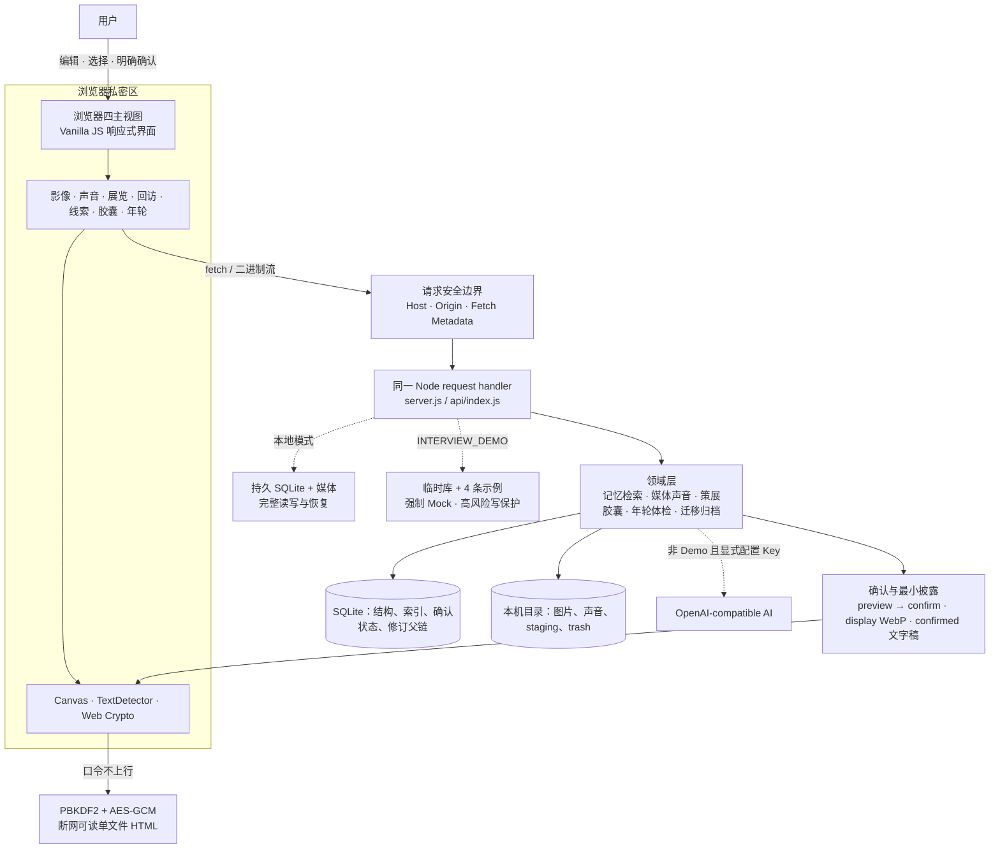

# 时屿 V7.2 本地基线面试展示手册

> 状态（2026-07-18）：本地为 `V7.2.0 / schema 10` 完成基线；公开线上 Demo 仍为 `V7.1.0 / schema 9`。核心叙事是把不可替代的私人原文、照片与声音保存为可复核证据，让有效修改形成可校验年轮，再经用户确认用于回顾、封存和最小化加密分享。

## 一句话定位

时屿不是“可以放图片的备忘录”，而是一套本地优先的私人记忆策展工具：AI 或规则只生成草稿，原文与多模态来源保持独立；有效修改进入可校验年轮，用户确认后的展览才可以封存到未来，或在浏览器内生成口令加密、断网可读的单文件。

## 60 秒展示路线

面试前预先打开两个标签：

- 线上公开 Demo：`https://ai-memory-museum-demo.vercel.app`
- 本地 V7.2：`http://127.0.0.1:3000/#reflect`，只使用虚构测试数据

| 时间 | 操作 | 讲什么 |
| --- | --- | --- |
| 0–8 秒 | 展示线上首页和四项导航 | 页面始终只有四个主任务；公开环境使用临时示例并禁止私人媒体写入。 |
| 8–18 秒 | 在展品库搜索“阿棠” | 两字短线索也能找到两条毕业记忆，并展示命中字段、确认实体和短词回退依据。 |
| 18–30 秒 | 点击《操场尽头的告别》的标题区域，再点“沿这段记忆漫游” | 展品说明与原始记忆分开保存；系统只给出可解释关联，不自动认定同一事件。 |
| 30–45 秒 | 打开《后来写下的毕业傍晚》对应的“查看拼图” | 人物、地点和“毕业”有双侧原文锚点；日期相差一天；缺证据的部分明确保留未知。 |
| 45–60 秒 | 切到本地“胶囊与分享” | 用一句话展示“未到期只见外壳 → 选择安全素材 → 浏览器口令加密 → 单文件断网阅读”。 |

这条线上主线已在 V7.1.0 公开 Demo 实际走通。最后 15 秒使用本地持久测试数据，是因为公开 Demo 刻意不保存展览、声音或时间胶囊；V7.2 的年轮、体检与只读验真也只在本地展示。不要在公开页面现场上传私人内容，也不要把禁写保护描述成缺失功能。

如果现场网络不稳定，只演示本地标签；如果本地胶囊素材尚未准备好，就停在时光拼图并口述加密边界，不临时制造或上传真实私人素材。

## V7.2 45 秒专项路线

提前准备一件至少有两个版本的虚构展品，以及一份由当前本地版本导出的测试 `.time-isle`：

1. 在本地 `#reflect` 展开“记忆年轮”，点进虚构展品并查看旧版：说明“规范快照按 SHA-256 父链连续校验，但它不是区块链或外部签名”。
2. 选择旧版并确认恢复：说明“恢复会复制出新的 `restored` 最新版，当前版和旧版都不删除；过期页面还会被 `If-Match` 拦住”。
3. 切到 `#data` 展开“馆藏体检”，开始扫描：说明“只读核对 SQLite、图片和声音，不自动修复，结果只在本次运行内”。
4. 选择测试 `.time-isle` 验真：说明“调用正式恢复前的同一套严格验证，但只返回可恢复摘要，不写入当前馆藏”。

如果不想现场改变测试展品，就停在恢复确认框并口述第 2 步；如果没有预备归档，跳过第 4 步，不能临时选择私人备份。

## 三分钟深挖路线

1. 在“记录记忆”展开添加照片与添加声音，说明两种图片隐私策略、三段声音上限和人工确认文字稿。
2. 打开一件含图片的虚构展品，展示安全展示图、图片区域证据、来源 SHA-256 与“用户确认”是两层不同保证。
3. 展开“记忆年轮”，查看旧版并停在恢复确认框，说明有效修改、no-op、SHA-256 父链和 `If-Match` 并发边界。
4. 进入记忆航线与时光拼图，强调相似线索、手动叠影和日期差异都不会触发自动合并。
5. 从已确认主题展览进入“胶囊与分享”，展示未到期开启返回外壳而不读取载荷。
6. 只选择一张 display WebP 和一份 confirmed 文字稿，生成自包含 HTML；说明日期负责仪式感，Web Crypto 才负责分享保密。
7. 在“数据与项目”运行只读馆藏体检，说明待复核内容与结构损坏分开呈现且不会自动修复。
8. 用测试 `.time-isle` 做只读验真，再说明正式恢复前全量校验、失败零业务写入和 Schema 10 年轮往返；公开 Demo 不接收归档。

## 90 秒讲解稿

时屿不是相册，也不只是一个能放图片的备忘录。我把它定义成一个本地优先的私人记忆策展工具。用户保存原文、照片和声音，AI 或本地规则只生成可编辑草稿，原文始终单独保留。照片区域还会同时记录规范坐标和内容 SHA-256，把“来源仍可校验”和“这条说明由用户确认”分成两层。

屏幕上的两条毕业记忆，人物和地点相同，但日期相差一天。系统会展示两边的原文锚点、稳定线索和描述差异，却不会自动认定它们是同一事件，更不会覆盖任何一段原文，最后决定权仍在用户。

V7 又把“留给未来”和“安全交给别人”拆成两套边界。时间胶囊的日期只提供仪式门槛，未到期接口在读取私密载荷前就返回 423；真正的分享保密发生在浏览器端，只把用户明确勾选的安全展示图和已确认文字稿，用 PBKDF2-SHA-256 和 AES-256-GCM 加密成一个断网可读的 HTML，口令不会上传服务器。

V7.2 再补上“记忆如何变化”的证据：有效修改形成规范快照的 SHA-256 父链，无变化保存不制造版本；恢复旧版只新增一个 `restored` head，原历史完整保留，`If-Match` 则阻止过期页面覆盖新修改。这条链可以发现断裂，但不是区块链或不可篡改审计系统。

数据默认保存在本地 SQLite 和媒体目录。馆藏体检只读核对数据库、图片和声音；`.time-isle` 也可先只读验真，正式恢复前再核对路径、哈希、格式、引用和年轮，通过 SQLite 事务与文件补偿落盘。公开 Demo 仍是 V7.1，使用临时数据、强制 Mock 并关闭私人媒体写入。项目当前没有账号、云同步或万能 OCR，这些是我明确保留的产品边界。

## 架构一图

## 七个可追问亮点

| 亮点 | 可以怎么说 | 代码证据 |
| --- | --- | --- |
| 可复核多模态证据 | 图片区域同时锚定规范坐标和 SHA-256，并区分来源完整性与用户语义确认。 | [`lib/media-evidence.js`](../lib/media-evidence.js)、[`scripts/media-evidence-check.js`](../scripts/media-evidence-check.js) |
| 未到期零载荷读取 | 胶囊 API 在调用载荷读取函数前返回 423，不是读出正文后再删字段。 | [`lib/capsule-api.js`](../lib/capsule-api.js)、[`scripts/capsule-api-check.js`](../scripts/capsule-api-check.js) |
| 浏览器端最小化加密 | 素材先验真，之后才显示口令；只打包 display WebP 与 confirmed 文字稿。 | [`public/assets/capsules.js`](../public/assets/capsules.js)、[`public/assets/capsule-crypto.js`](../public/assets/capsule-crypto.js) |
| 严格归档与失败补偿 | `.time-isle` 拒绝路径逃逸、链接、碰撞和损坏清单；恢复使用数据库事务并补偿本次已移动文件。 | [`lib/time-isle-archive.js`](../lib/time-isle-archive.js)、[`lib/media-restore.js`](../lib/media-restore.js) |
| 不覆盖式记忆年轮 | 规范快照以 SHA-256 父链连续验真；no-op 不制造版本，旧版恢复新增 head，`If-Match` 防止丢失更新。 | [`lib/revision-database.js`](../lib/revision-database.js)、[`lib/revision-api.js`](../lib/revision-api.js)、[`scripts/memory-version-check.js`](../scripts/memory-version-check.js) |
| 只读体检与备份验真 | 数据库、图片和声音只读核对；归档复用正式恢复验证器但不写馆藏，并拒绝未来 schema。 | [`lib/collection-health.js`](../lib/collection-health.js)、[`lib/archive-inspection-api.js`](../lib/archive-inspection-api.js) |
| 公开 Demo 失效安全 | 临时 SQLite、代码层强制 Mock、领域级写保护和固定容量共同保护共享演示。 | [`server.js`](../server.js)、[`lib/demo-safety.js`](../lib/demo-safety.js)、[`lib/request-security.js`](../lib/request-security.js) |

## 常见追问与边界

- **这是原生 App 吗？** 不是。它是响应式 Web 应用，手机和桌面浏览器共用同一套界面；V7.1 已提供可安装 PWA 外壳，但不是完整离线馆藏。Service Worker 不缓存首页、API 或私人媒体，断网时只展示隐私边界页和重新连接入口。
- **“语义检索”是向量数据库吗？** 不是。当前是 FTS5 trigram、短词参数化 LIKE 回退、字段加权和实体线索；界面会明确展示召回依据。
- **OCR 能识别所有图片吗？** 不能。只在浏览器本机 `TextDetector` 可用时生成草稿，否则回退为手动摘录；没有云端图片理解。
- **时间胶囊真能防止提前打开吗？** 本地日期只是仪式门槛，不是可信第三方时间锁；真正的分享保密来自另行生成的加密文件。
- **离线分享是端到端协作平台吗？** 不是。它没有账号托管、撤回、远程失效或口令找回，首版也不携带原图、EXIF/GPS 或原始音频。
- **SHA-256 年轮是不可篡改日志吗？** 不是。它能验证规范快照、父链连续性和恢复来源，但本机数据库管理员仍能整体重写数据；当前没有外部签名、可信时间戳或远端见证。
- **馆藏体检会自动修复损坏吗？** 不会。它只读核对并最小化列出待处理项；备份验真也只回答能否安全恢复，不把内容写入当前馆藏。
- **归档恢复是分布式事务吗？** 不是。它是本机 SQLite 事务加文件补偿，不应夸大为跨设备原子事务。
- **公开 Demo 能存私人内容吗？** 不能。它是共享、临时、禁媒体写入的面试环境，不是私人云存储。
- **线上已经是 V7.2 吗？** 还不是。截至 2026-07-18，V7.2 是本地完成基线，线上公开 Demo 仍为 V7.1；面试时必须分开表述。

## 面试前一分钟检查

1. 打开线上 `/api/health`，确认 `version: 7.1.0`、`schemaVersion: 9` 和 `mode: interview-demo`。
2. 打开本地 `/api/health`，确认 `version: 7.2.0`、`schemaVersion: 10`；完整检查中的 HTTP smoke 应为 186 条断言。
3. 用隔离测试数据库启动本地服务，只保留完全虚构的照片、声音、展览、文字稿、胶囊和至少两版展品。
4. 预先准备并验过一份虚构 `.time-isle`，打开线上展品库、本地“讲解与回顾”、本地“数据与项目”和离线 HTML 标签。
5. 关闭系统通知；演示录音时提前确认麦克风权限，公开 Demo 不请求麦克风。
6. 网络或浏览器能力失败时直接走本地后备路线，不临时改配置或上传私人文件。
