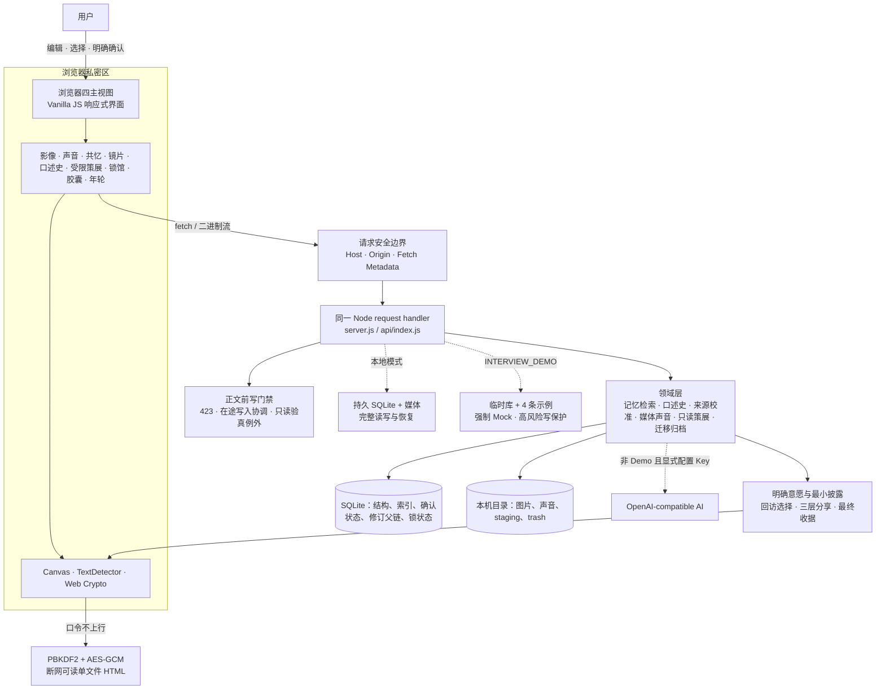

# 时屿 V14 已发布版面试展示手册

> 状态（2026-07-20）：`V14.0.0 / schema 19` 已发布，功能提交为 `2dcce402b13f1d43c54c6a196b8e2273c9483eb3`，GitHub 与 Gitee 的 `main` 已对齐。完整 build/check、262 条真实 HTTP smoke、15/15 项三档 Playwright 与同三档真实目视均已通过；Vercel 生产接口已核验为 `14.0.0 / schema 19 / interview-demo / ephemeral-sqlite / mock-fallback`。面试时应明确区分“线上 V14 受保护的共享临时 Demo”和“本地 V14 完整可写能力”：前者只允许硬上限内的核心纯文本体验，V11–V14 新模块与高风险写操作保持只读或禁用。V10 的 249 条 smoke 与具体专项数字只能作为历史基线。

## 一句话定位

时屿不是“可以放图片的备忘录”，而是一套本地优先的私人记忆策展工具：它让原文、多模态证据和他人见证保持独立，用零模型的可解释镜片帮助回看，并把策展、入馆、分享、锁馆和恢复判断都留给用户明确决定。

## 60 秒展示路线

面试前预先打开两个标签：

- 线上公开 Demo：`https://ai-memory-museum-demo.vercel.app`
- 本地后备：`http://127.0.0.1:3000/#reflect`，只使用虚构测试数据

| 时间 | 操作 | 讲什么 |
| --- | --- | --- |
| 0–8 秒 | 展示线上首页和四项导航 | 页面始终只有四个主任务；公开环境使用临时示例并禁止私人媒体写入。 |
| 8–18 秒 | 在展品库搜索“阿棠” | 两字短线索也能找到两条毕业记忆，并展示命中字段、确认实体和短词回退依据。 |
| 18–30 秒 | 点击《操场尽头的告别》的标题区域，再点“沿这段记忆漫游” | 展品说明与原始记忆分开保存；系统只给出可解释关联，不自动认定同一事件。 |
| 30–42 秒 | 打开《后来写下的毕业傍晚》对应的“查看拼图” | 人物、地点和“毕业”有双侧原文锚点；日期相差一天；缺证据的部分明确保留未知。 |
| 42–60 秒 | 继续在线打开“讲解与回顾”中的受限策展助手 Demo sample | 四项工具全是本地只读；sample 是合成、未保存内容，保存草稿/确认关系/发布要逐项决定，分享不在助手权限内。 |

V14 公开 Demo 已部署这条 60 秒主线所需的界面与 API，可优先按全线上路线演示；发布核验已实际确认版本接口与策展 sample 为 `synthetic + demo`，调用前后 `runs` 仍为 `0 → 0`。锁馆和结构演练使用虚构 `text/plain` 正文的生产探针均返回 `403 / MUSEUM_LOCK_DEMO_READ_ONLY / bodyBytesRead: 0`，前后 stats、锁状态和 runs 不变。面试前仍按下方清单目视复核页面，并保留本地后备。公开模式不请求麦克风、不打开文件选择，并拒绝策展助手全部非只读请求以及口述史、校准、展览、胶囊、声音或长期回访意愿写入。不要在公开页面上传私人内容，也不要把禁写保护描述成缺失功能。

如果现场网络不稳定，只演示本地标签；如果本地胶囊素材尚未准备好，就停在时光拼图并口述加密边界，不临时制造或上传真实私人素材。

## V10 60 秒专项路线

先用线上 `INTERVIEW_DEMO` 展示零写 sample；若要演示逐项决定，必须切到隔离可写数据库并只使用虚构内容：

1. 在 `#reflect` 打开“受限策展助手”，先指出它没有新增导航，仍位于“讲解与回顾”的渐进对话层。
2. Demo sample 明确标记“只读、未保存”；打开技术回执，展示固定预算：6 步、4 次工具、2 秒、262,144 字节、最多 6 件来源。
3. 展示四项工具名：搜索摘要、读取记忆证据、读取已确认关系、读取展览摘要。说明执行器是本地确定性规则，不调用外部大模型、网络、文件或任意 SQL。
4. 展开提案和引用：`requestSha256 / sourceSetSha256 / proposalSha256` 用于回执与来源变化检测，不代表提案是真理，也不证明关系正确。
5. 在隔离可写模式创建并执行一次运行；分别展示“保存为草稿”“确认/拒绝候选关系”“发布到本馆”。三项决定都使用 ETag、幂等键和显式确认，前一项批准不会批量授权后一项。
6. 修改一件来源后回到旧提案，展示它进入 `needsReview` 且只能只读；运行中断也不会自动续跑，必须重新提出主题。
7. 指出分享不在助手 action 中：发布后只交接三层隐私编辑台，所有私人材料仍默认不选。Demo 的 POST/DELETE 在读取请求体前返回 403，sample 不创建运行。

如果没有准备隔离可写数据，只展示 sample、预算、引用和禁写边界，不临时修改公开 Demo。不要把本地规则描述成外部大模型，也不要把“发布到本馆”说成自动分享。

## V12–V14 线上边界与本地完整能力 90 秒路线

线上只展示设备内镜片以及共忆、锁馆和结构演练的只读 / 禁写边界；以下完整交互必须切到隔离本地 V14 并只使用虚构数据。开场明确说“线上是受保护的共享临时 Demo，这些新增模块保持零写；本地才开放完整可写能力”：

1. 从一件虚构展品生成共忆邀请，指出邀请与回信都由浏览器 PBKDF2 + AES-GCM 加密，文件不会自动发送。打开离线邀请页并导出回信，再回到馆主侧展示“自述身份、未验证、已加密但未签名”。
2. 预览回信后点击明确确认入馆；强调它作为独立来源保存，不合并原文、不推断人物、关系或日期。馆外文件是密文，但入馆后的问答仍是本机 SQLite 明文。
3. 在“讲解与回顾”展开设备内镜片，运行“时间”和“证据”两种视图，打开回执说明 `externalModel: false / toolCalls: 0 / persisted: false`。选择 2–6 件可交给策展助手，7 件以上会要求重选而不是截断。
4. 在“数据与项目”锁馆，尝试新增或编辑并展示 423；随后继续导出或运行结构演练，说明锁馆只阻止新的应用写入，不加密 SQLite/媒体/磁盘。
5. 打开结构演练结果，只说“manifest、哈希与引用的结构验真通过”；明确四项 false：没有执行当前恢复、没有执行隔离恢复、不证明灾难恢复、不提供磁盘加密。不要说“恢复成功”。

V14 发布版已完成整库门禁、262 条真实 HTTP smoke、15/15 项三档 Playwright 与同三档目视验收，GitHub/Gitee `main` 与 Vercel 生产版本均已核验。可以准确展示 V14 已发布，但不能把线上受保护 Demo 说成支持真实共忆入馆、锁馆切换或备份上传；这些完整操作仍只在隔离本地环境演示。若后续代码发生变化，必须重新运行门禁后再演示变化部分。

## 三分钟深挖路线

1. 在“记录记忆”展开添加照片与添加声音，说明两种图片隐私策略、三段声音上限和人工确认文字稿；再区分普通展品声音与事件级口述回答。
2. 打开一件含图片的虚构展品，展示安全展示图、图片区域证据、来源 SHA-256 与“用户确认”是两层不同保证。
3. 展开“记忆年轮”，查看旧版并停在恢复确认框，说明有效修改、no-op、SHA-256 父链和 `If-Match` 并发边界。
4. 进入记忆航线与时光拼图，先展开来源校准台，再展开一问一答口述史；强调相似线索、手动叠影、日期差异和口述回答都不会触发自动合并、自动转写或事实裁决。
5. 在展品详情设置“欢迎、延期或暂停”之一，再恢复自然回访；说明没有保存原因，也没有从浏览行为推断重要程度。
6. 从已确认主题展览进入“胶囊与分享”，展示未到期开启返回外壳而不读取载荷。
7. 在三层编辑台逐章、逐件选择一张 display WebP 和一份 confirmed 文字稿，核对受众、用途、计数和不可撤回边界，再生成自包含 HTML。
8. 打开受限策展助手，展示只读工具、固定预算、未保存提案和三项独立决定；再打开 evaluation，说明它只重放已保存回执，不重新执行工具或副作用。
9. 在“数据与项目”运行只读馆藏体检，并用测试 `.time-isle` 验真 schema 19 的既有时间线/口述史/策展 section，以及新增 `inbox/state.json`、`provenance/state.json`、`co-memory/responses.json`；锁状态与 verifier 不进入归档。
10. 用虚构数据追加共忆信笺、设备内镜片、锁馆与结构演练；明确三个“不是”：加密回信不是身份认证，锁馆不是静态加密，结构演练不是恢复成功。

## 90 秒讲解稿

时屿不是相册，也不只是一个能放图片的备忘录。我把它定义成一个本地优先的私人记忆策展工具。用户保存原文、照片和声音，AI 或本地规则只生成可编辑草稿，原文始终单独保留。照片区域还会同时记录规范坐标和内容 SHA-256，把“来源仍可校验”和“这条说明由用户确认”分成两层。

屏幕上的两条毕业记忆，人物和地点相同，但日期相差一天。系统会展示两边的原文锚点、稳定线索和描述差异，却不会自动认定它们是同一事件，更不会覆盖任何一段原文，最后决定权仍在用户。

V8 在用户已经确认“这是同一往事”之后增加来源校准台。它把当前日期、修订、原文日期锚点和照片 EXIF 分开呈现，用户可以确认单日、范围、保留多种记录或继续不确定。来源集合变化时，旧判断只进入待复核，不被删除；稳定哈希用于发现来源变化，不用于证明哪一段记忆为真。

V9 再回答“书面来源仍解释不了时怎么办”。系统只为符合条件的确认事件生成一个问题；用户录音或选择本地音频后，亲手划定片段、填写文字稿并明确回答代表单日、范围还是仍不确定。它不自动转写、识别说话人或判断情绪。只有人工确认的 day/range 成为事件级口述来源；uncertain 只留下可回看的证据，重答和撤回都保留追加历史，不覆盖原始记忆。

V10 再回答“怎样让助手帮忙，但不让它越权”。它只在本机用四项只读工具和固定预算查阅馆藏，输出绑定来源摘要的未保存提案；不访问网络、文件、任意 SQL，也不调用外部大模型。保存草稿、确认候选关系和发布是三次独立的人工作决定，分享仍要进入最小披露编辑台。保存回执可以重放评测，来源改变或进程中断只会把旧运行变成只读待复核，不会后台续跑。

V12–V14 再把“他人见证、换角度回看和暂停写入”做成三个克制模块。共忆信笺在浏览器端加密请求与回信，但身份始终未验证、文件未签名，入馆后也只是独立来源；设备内镜片只用确定性规则重排保存态，零模型、零工具、零保存；锁馆只在正文前阻止新的应用写入，不加密 SQLite 或媒体。结构演练也只验 manifest、哈希和引用，没有执行恢复，更不证明灾难恢复能力。这些能力已经随 V14 发布；线上公开 Demo 只开放合成/播种数据上的只读预览和禁写边界，本地 V14 才开放使用虚构数据演示的完整可写流程。

V7 又把“留给未来”和“安全交给别人”拆成两套边界。时间胶囊的日期只提供仪式门槛，未到期接口在读取私密载荷前就返回 423；真正的分享保密发生在浏览器端。V7.3 再加入三层隐私编辑台：公开外壳使用不含来源标题和导出时间的通用默认值；受众、用途、叙事副本与逐项证据都在密文内；最后用精确收据再次确认。只有用户勾选的安全材料才会进入 PBKDF2-SHA-256 与 AES-256-GCM 加密的断网 HTML。

V7.2 再补上“记忆如何变化”的证据：有效修改形成规范快照的 SHA-256 父链，无变化保存不制造版本；恢复旧版只新增一个 `restored` head，原历史完整保留，`If-Match` 则阻止过期页面覆盖新修改。这条链可以发现断裂，但不是区块链或不可篡改审计系统。

V7.3 还回答“以后怎样再见”：欢迎、指定日期以后或暂停都必须由用户明确确认。系统只做确定性筛选和排序，不保存原因、不猜心情，也不影响馆藏和搜索；恢复自然回访会删除这条长期偏好。schema 11 将它作为独立 required section 进入完整归档，脱敏时只留下总数。

数据默认保存在本地 SQLite 和媒体目录。V14 schema 19 的完整 `.time-isle` 追加收件箱、来源护照和共忆回信，但锁状态、salt、digest 与 verifier 始终不进入普通归档。公开 Demo 已是 V14，但仍是共享、临时、受保护的面试环境；核心纯文本仅可在硬上限内临时体验，V11–V14 新模块与高风险写操作保持只读或禁用。项目没有账号、云同步、万能 OCR、自动语音理解、磁盘静态加密或自治发布，这些是明确边界。

## 架构一图

## 十六个可追问亮点

| 亮点 | 可以怎么说 | 代码证据 |
| --- | --- | --- |
| 可复核多模态证据 | 图片区域同时锚定规范坐标和 SHA-256，并区分来源完整性与用户语义确认。 | [`lib/media-evidence.js`](../lib/media-evidence.js)、[`scripts/media-evidence-check.js`](../scripts/media-evidence-check.js) |
| 未到期零载荷读取 | 胶囊 API 在调用载荷读取函数前返回 423，不是读出正文后再删字段。 | [`lib/capsule-api.js`](../lib/capsule-api.js)、[`scripts/capsule-api-check.js`](../scripts/capsule-api-check.js) |
| 三层隐私编辑台 | 候选材料默认不选；公开外壳、加密内容与精确收据分层核对，连续匿名化并物理排除内部字段和未选原文。 | [`public/assets/share-privacy.js`](../public/assets/share-privacy.js)、[`scripts/offline-exhibit-check.js`](../scripts/offline-exhibit-check.js) |
| 明确回访意愿 | welcome / later / pause 只来自用户确认，按本地日期与时区确定性生效，不把浏览行为包装成心理判断。 | [`lib/revisit-intent-database.js`](../lib/revisit-intent-database.js)、[`scripts/revisit-intent-check.js`](../scripts/revisit-intent-check.js) |
| 来源支持的不确定时间线 | 四类受控来源与稳定来源摘要支持单日、范围、多记录或不确定；来源变化只派生待复核，不回写原文。 | [`lib/time-calibration-service.js`](../lib/time-calibration-service.js)、[`public/assets/time-calibrations.js`](../public/assets/time-calibrations.js)、[`scripts/time-calibration-check.js`](../scripts/time-calibration-check.js) |
| 人工确认的一问一答口述史 | 只为未解决的事件冲突生成一个问题；人工选段、手填文字稿与显式时间含义形成追加式来源，ETag/问题摘要/幂等键防止过期或重复写入。 | [`lib/oral-history-service.js`](../lib/oral-history-service.js)、[`public/assets/oral-histories.js`](../public/assets/oral-histories.js)、[`scripts/oral-history-check.js`](../scripts/oral-history-check.js) |
| 受限本地策展与逐项决定 | 四项只读工具、固定预算、取消/中断和回执重放只生成提案；保存草稿、关系与发布分别人工确认，恢复后历史授权失效。 | [`lib/curator-agent-service.js`](../lib/curator-agent-service.js)、[`lib/curator-agent-database.js`](../lib/curator-agent-database.js)、[`scripts/curator-agent-check.js`](../scripts/curator-agent-check.js) |
| 可验证收件与来源护照 | 文档全文不落库，服务端重算 UTF-16 片段锚点；人工主张用不可变来源快照和追加事件表达支持/补充/不同记录，来源变化只待复核。 | [`lib/memory-inbox-service.js`](../lib/memory-inbox-service.js)、[`lib/provenance-service.js`](../lib/provenance-service.js)、[`scripts/provenance-check.js`](../scripts/provenance-check.js) |
| 加密但不冒认身份的共忆信笺 | 请求与回信浏览器端加密并由摘要绑定；身份固定未验证、文件未签名，只有预览确认后才成为独立来源。 | [`public/assets/co-memory-crypto.js`](../public/assets/co-memory-crypto.js)、[`lib/co-memory-response-service.js`](../lib/co-memory-response-service.js)、[`scripts/co-memory-integration-check.js`](../scripts/co-memory-integration-check.js) |
| 零模型的设备内镜片 | API 只接收 ID 并重读当前馆藏；四种确定性投影固定零模型、零工具、零保存，7–20 件策展交接不会静默截断。 | [`lib/memory-lens-service.js`](../lib/memory-lens-service.js)、[`lib/memory-lens-api.js`](../lib/memory-lens-api.js)、[`scripts/memory-lens-check.js`](../scripts/memory-lens-check.js) |
| fail-closed 锁馆与诚实恢复演练 | schema 19 单例/CAS/verifier 在正文前阻止新写入；结构演练只验 manifest、哈希和引用，不冒充静态加密、恢复成功或容灾证明。 | [`lib/museum-write-runtime.js`](../lib/museum-write-runtime.js)、[`lib/structural-recovery-drill.js`](../lib/structural-recovery-drill.js)、[`scripts/museum-lock-check.js`](../scripts/museum-lock-check.js) |
| 浏览器端最小化加密 | 口令不上行；V2 严格校验内容收据、匿名键和媒体归属，同时继续读取 V1 文件。 | [`public/assets/capsules.js`](../public/assets/capsules.js)、[`public/assets/capsule-crypto.js`](../public/assets/capsule-crypto.js) |
| 严格归档与失败补偿 | `.time-isle` 拒绝路径逃逸、链接、碰撞和损坏清单；恢复使用数据库事务并补偿本次已移动文件。 | [`lib/time-isle-archive.js`](../lib/time-isle-archive.js)、[`lib/media-restore.js`](../lib/media-restore.js) |
| 不覆盖式记忆年轮 | 规范快照以 SHA-256 父链连续验真；no-op 不制造版本，旧版恢复新增 head，`If-Match` 防止丢失更新。 | [`lib/revision-database.js`](../lib/revision-database.js)、[`lib/revision-api.js`](../lib/revision-api.js)、[`scripts/memory-version-check.js`](../scripts/memory-version-check.js) |
| 只读体检与备份验真 | 数据库、图片和声音只读核对；归档复用正式恢复验证器但不写馆藏，并拒绝未来 schema。 | [`lib/collection-health.js`](../lib/collection-health.js)、[`lib/archive-inspection-api.js`](../lib/archive-inspection-api.js) |
| 公开 Demo 失效安全 | 临时 SQLite、代码层强制 Mock、领域级写保护和固定容量共同保护共享演示。 | [`server.js`](../server.js)、[`lib/demo-safety.js`](../lib/demo-safety.js)、[`lib/request-security.js`](../lib/request-security.js) |

## 常见追问与边界

- **这是原生 App 吗？** 不是。它是响应式 Web 应用，手机和桌面浏览器共用同一套界面；V7.1 已提供可安装 PWA 外壳，但不是完整离线馆藏。Service Worker 不缓存首页、API 或私人媒体，断网时只展示隐私边界页和重新连接入口。
- **“语义检索”是向量数据库吗？** 不是。当前是 FTS5 trigram、短词参数化 LIKE 回退、字段加权和实体线索；界面会明确展示召回依据。
- **OCR 能识别所有图片吗？** 不能。只在浏览器本机 `TextDetector` 可用时生成草稿，否则回退为手动摘录；没有云端图片理解。
- **时间胶囊真能防止提前打开吗？** 本地日期只是仪式门槛，不是可信第三方时间锁；真正的分享保密来自另行生成的加密文件。
- **离线分享是端到端协作平台吗？** 不是。它没有账号托管、撤回、远程失效或口令找回，首版也不携带原图、EXIF/GPS 或原始音频。
- **系统会根据我跳过某段回忆判断心理吗？** 不会。长期回访意愿只接受明确选择；浏览、跳过和搜索不会自动生成 welcome、later 或 pause，也不会保存选择原因。
- **为什么不让 AI 直接选一个“正确日期”？** 日期锚点、修订和 EXIF 只能说明不同来源记录了什么，不能证明哪段回忆为真。V8 让用户选择单日、范围、多种记录或继续不确定，不生成真相分数。
- **口述史会自动转写或识别谁在说话吗？** 不会。音频片段、文字稿与 day/range/uncertain 都由用户亲自选择；系统不识别说话人、不判断情绪，也不从声音推断事实。
- **重新回答会覆盖旧录音吗？** 不会。新确认回答只把旧回答标记为 `superseded`，撤回使用 `withdrawn`；历史默认折叠保留，被引用的声音也受使用量保护。
- **来源后来变化了怎么办？** 旧判断会原样保留并标记 `needsReview`；系统重新展示当前来源集合，由用户决定是否复核，不会静默覆盖原判断或展品日期。
- **这是会自己行动的 Agent 吗？** 不是。V10 执行器只有四项本地只读工具和固定预算，只生成未保存提案；它没有外部大模型、任意工具、后台循环、自动发布或分享权限。
- **提案怎样变成展览？** 用户分别决定保存草稿、确认候选关系和发布；每项都有独立 `confirm + If-Match + Idempotency-Key`，保存的授权不会自动扩展到发布，更不会扩展到分享。
- **归档恢复会不会重放旧批准？** 不会。运行、步骤、提案和决定会迁移，但全部重写 ID/幂等域并强制标记为历史、待复核、禁止决定；批准只作为审计回执保留。
- **共忆回信加密后，能证明是谁写的吗？** 不能。它只证明密文没有被 AES-GCM 静默篡改且回信绑定对应请求；身份标签仍是自述、未验证，文件没有数字签名或可信时间戳。
- **共忆信笺是否把本机数据库也加密了？** 没有。馆外请求/回信文件是密文，确认入馆后的问答和来源锚点是 SQLite 明文，仍依赖系统账号与磁盘保护。
- **设备内镜片是本地大模型或向量检索吗？** 都不是。它按明确 ID 重读保存态，用固定规则生成时间、共同出现、证据与线索投影，零外部模型、零工具调用、零保存。
- **锁馆等于整馆加密吗？** 不等于。它只让新的应用写请求在读取正文前返回 423；SQLite、图片、声音和磁盘仍是明文，拥有文件权限的人可以绕过应用。
- **结构演练通过就代表备份一定能恢复吗？** 不代表。它只核对完整归档的 manifest、哈希和引用，没有执行当前馆藏恢复或隔离恢复，也不证明灾难恢复能力。
- **SHA-256 年轮是不可篡改日志吗？** 不是。它能验证规范快照、父链连续性和恢复来源，但本机数据库管理员仍能整体重写数据；当前没有外部签名、可信时间戳或远端见证。
- **馆藏体检会自动修复损坏吗？** 不会。它只读核对并最小化列出待处理项；备份验真也只回答能否安全恢复，不把内容写入当前馆藏。
- **归档恢复是分布式事务吗？** 不是。它是本机 SQLite 事务加文件补偿，不应夸大为跨设备原子事务。
- **公开 Demo 能存私人内容吗？** 不能。它是共享、临时、禁媒体写入的面试环境，不是私人云存储。
- **V10 现在是什么状态？** V10.0.0 / schema 14 是 2026-07-19 的历史发布基线；当时的 249 条 smoke、具体专项数字、双远端和生产核验只用于说明版本演进，不应当作 V14 的当前测试或线上结果。
- **线上已经是 V14 吗？** 是。2026-07-20，功能提交 `2dcce402b13f1d43c54c6a196b8e2273c9483eb3` 已进入 GitHub/Gitee 对齐的 `main`，生产接口核验为 `14.0.0 / schema 19 / interview-demo / ephemeral-sqlite / mock-fallback`。策展 sample 为 `synthetic + demo` 且 runs 为 0；锁馆和结构演练虚构探针均以 `403 / MUSEUM_LOCK_DEMO_READ_ONLY / bodyBytesRead: 0` 拒绝，前后 stats、锁状态和 runs 不变。这只证明本次实际探测的三项边界生效，不代表公开环境全局零写，也不代表它开放完整写能力。

## 面试前一分钟检查

1. 打开线上 `/api/health` 与 `/api/version`，确认 `version: 14.0.0`、`schemaVersion: 19`、`mode: interview-demo`、`storage: ephemeral-sqlite` 和 `aiMode: mock-fallback`；打开策展 sample，确认 `synthetic: true`、`demo: true`，且调用前后 `runs` 为 `0 → 0`。若展示生产探针记录，只使用虚构 `text/plain` 正文，并确认锁馆与结构演练均为 `403 / MUSEUM_LOCK_DEMO_READ_ONLY / bodyBytesRead: 0`，前后 stats、锁状态和 runs 不变。
2. 开场明确“线上 V14 是受保护的共享临时 Demo，核心纯文本仅可在硬上限内体验；本地 V14 才有完整可写能力”；V10 的 249 条 smoke 和既有专项数字只按历史发布基线介绍，不与 V14 的 262 条 smoke、15/15 Playwright 和三档目视结果混用。
3. 用隔离测试数据库启动本地服务，只保留完全虚构的照片、声音、共忆问答、镜片来源、展览、策展决定链、时间校准、口述回答、胶囊、回访意愿和至少两版展品。
4. 预先准备并验过一份虚构 schema 19 完整 `.time-isle`，同时准备独立口令；锁馆前确认当前状态可写，演练后确认页面只显示结构验真而非恢复成功。
5. 关闭系统通知；演示录音时提前确认麦克风权限，公开 Demo 不请求麦克风。
6. 网络或浏览器能力失败时直接走本地后备路线，不临时改配置或上传私人文件。

V14 已于 2026-07-20 完成发布闭环：功能提交 `2dcce402b13f1d43c54c6a196b8e2273c9483eb3`、GitHub/Gitee `main` 对齐、完整 build/check、262 条真实 HTTP smoke、15/15 项三档 Playwright、同三档真实目视、Vercel 版本与策展 sample/锁馆/结构演练三项零写核验均已完成。面试中可以准确表述“V14 已发布”，同时必须继续说明线上只是受保护的共享临时 Demo，完整可写能力只在隔离本地 V14 中演示；V10 的数字只保留为历史基线。
